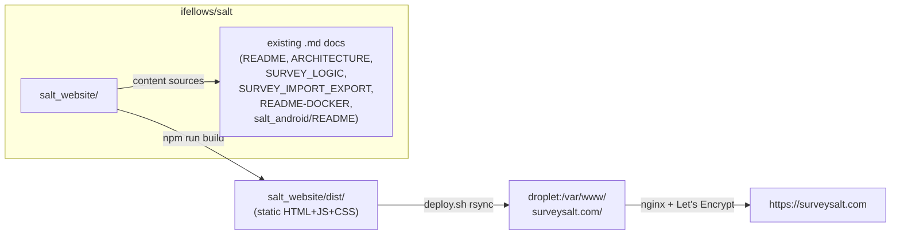

# salt_website/ — handoff for an auto-mode Claude session

This is a self-contained briefing. You can execute end-to-end from this file
alone. The approved plan is reproduced verbatim in [§Approved plan](#approved-plan)
at the bottom.

---

## 1. Mission

Build a static **marketing + documentation** website for SALT at
`surveysalt.com`. Framework: **Astro + Starlight**. Source lives in
`salt_website/` inside this repo. Audience: **public-health professionals and
survey administrators** — not developers.

The site must:

- Explain what SALT is and why to use it.
- Document the management server **tab by tab** (every option, what it does).
- Document the Android app's **staff** and **admin** areas.
- Stay non-code, except the one getting-started install command and GitHub
  links.

---

## 2. Pre-staged state (already done — don't redo)

- **Branch:** `salt-website` (off `main`). You should already be on it; if not,
  `git checkout salt-website`. Do **not** merge to `main`, do **not** push, do
  **not** deploy.
- **`salt_website/screenshots/`** — a working tray of ~36+ PNG screenshots,
  staged by the project owner. Two filename patterns, which are useful hints:
  - `Screenshot YYYY-MM-DD at H.MM.SS PM.png` — macOS captures, generally
    **management-server / admin UI**.
  - `Screenshot_YYYYMMDD_HHMMSS.png` — Android captures, generally **tablet
    screens**.
- The approved plan was saved at
  `/Users/ianfellows/.claude/plans/generic-sauteeing-conway.md`. The full text
  is also reproduced in [§Approved plan](#approved-plan) below — use that copy
  if the home-dir path is not accessible from your sandbox.

Everything else under `salt_website/` is yours to create.

---

## 3. Source materials (read-only)

Read these for content. Summarise for a public-health audience — do **not**
copy source-code internals into the site.

| Source path | Used for |
|---|---|
| `README.md` (repo root) | Tagline, install one-liner |
| `ARCHITECTURE.md` | How it works (three-tier overview) |
| `SALT.md` (and `SALT.pdf` if present) | Methodology framing, value props |
| `salt_management/README.md` | Tab content reference (de-jargon) |
| `salt_management/README-DOCKER.md` | Docker / existing-server deployment |
| `salt_management/SURVEY_LOGIC.md` | Survey-logic page (drop in near-verbatim) |
| `salt_management/SURVEY_IMPORT_EXPORT.md` | Import/export page (de-jargon) |
| `salt_management/src/web/views/partials/nav.ejs` | Authoritative admin tab list |
| `salt_management/src/web/views/pages/*.ejs` | Per-tab fields/options/buttons |
| `salt_android/README.md` | Tablet setup, troubleshooting |
| `salt_android/app/src/main/java/com/dev/salt/ui/*Screen.kt` | Android screen inventory |

Canonical external references for the sampling-methods table:
- RDS → https://www.lisagjohnston.com/respondent-driven-sampling
- Starfish → https://pubmed.ncbi.nlm.nih.gov/30328063/
- BBS-lite → https://www.unaids.org/en/resources/documents/2024/BBS-lite-tool

GitHub repo (the only "code" link on the site): https://github.com/ifellows/salt

---

## 4. Execution order

Do these in order. Each step is independent and recoverable.

### 4.1 Scaffold the Astro + Starlight project (write files directly)

Do **not** run interactive `npm create astro` — `salt_website/` already
contains the screenshots tray; an interactive scaffolder will balk. Write the
project files directly:

- `salt_website/package.json` — deps: `astro` and `@astrojs/starlight`
  (latest stable). Scripts: `dev`, `build`, `preview`, `astro`.
- `salt_website/astro.config.mjs` —
  - `site: 'https://surveysalt.com'`
  - Starlight integration with: `title: 'SALT'`, `description`, the GitHub
    social link to `https://github.com/ifellows/salt`, the sidebar tree from
    plan §3, search on (Pagefind default).
- `salt_website/tsconfig.json` — `extends: 'astro/tsconfigs/strict'`.
- `salt_website/src/content.config.ts` — Starlight docs collection (per the
  current Starlight quick-start docs).
- `salt_website/public/favicon.svg` — a simple placeholder is fine.
- `salt_website/src/assets/` — directory for the logo and screenshots
  (created in step 4.4).

### 4.2 Landing page

Write `salt_website/src/content/docs/index.mdx` using Starlight's `splash`
template:

- **Hero** — product tagline (lift from `README.md`):
  *"SALT is a platform for running any link-tracing survey design… takes the
  guesswork out of sampling…"* CTAs: **Get started** · **Read the docs** ·
  **GitHub**.
- **Value props** (Starlight `CardGrid`): Cheaper · Easier · Faster ·
  Continuous · Statistically valid (from `SALT.md`/README).
- **Sampling-methods comparison** — the table below, closing with the line
  *"The SALT software supports all link-tracing designs (SALT, RDS, Starfish,
  BBS-lite)."*

  | Sampling method | Recruitment links traced | Long chains (few seeds) | Dedicated survey staff required | Continuous recruitment |
  | --- | --- | --- | --- | --- |
  | **SALT** | Yes | Yes | No | Yes |
  | [RDS](https://www.lisagjohnston.com/respondent-driven-sampling) | Yes | Yes | Yes | No |
  | [Starfish](https://pubmed.ncbi.nlm.nih.gov/30328063/) | Yes | No | Yes | No |
  | [BBS-lite](https://www.unaids.org/en/resources/documents/2024/BBS-lite-tool) | Yes | No | No | No |
  | Snowball | No | Maybe | Maybe | No |
- **How it works** — the three-tier overview from `ARCHITECTURE.md` (tablets ⇄
  management server ⇄ analytics) in plain language.
- CTAs to Getting Started and the GitHub repo.

Tone throughout the site: task-oriented, plain language. No code beyond the
install command.

### 4.3 Documentation pages

Build out every page listed in plan §3. For each:

- **Admin-tab pages**: open the corresponding `.ejs` view under
  `salt_management/src/web/views/pages/` and enumerate every field, option,
  button, and modal — described in user terms.
- **Tablet-app pages**: open the corresponding `*Screen.kt` under
  `salt_android/app/src/main/java/com/dev/salt/ui/` and describe what the
  screen does, what staff/participants see, and what each action means.
- **Survey-logic page**: drop in `salt_management/SURVEY_LOGIC.md`
  near-verbatim (it's already written for non-coders).
- **Glossary**: brief one-paragraph entries for RDS, Starfish, BBS-lite,
  Snowball, link-tracing, ACASI, coupon, seed, eligibility, rapid test,
  fingerprint screening. Cite the canonical references above for RDS, Starfish,
  BBS-lite.

If any page can't be sourced confidently, ship it as a clearly-labelled stub
(`> **Stub** — needs content from <source>.`) and list it in the final report.

### 4.4 Screenshots

For each PNG in `salt_website/screenshots/`:

1. Open it (the Read tool reads PNGs).
2. Identify which admin tab or tablet screen it shows. Filename pattern is a
   hint: macOS-style → admin, Android-style → tablet.
3. Rename and move to `salt_website/src/assets/screenshots/`:
   - Admin tabs: `admin-<tab>-<subview>.png`
     (e.g. `admin-facilities-edit-modal.png`).
   - Tablet screens: `tablet-<screen>.png`, where `<screen>` is the
     `*Screen.kt` filename in lower-kebab-case (e.g. `tablet-coupon.png`,
     `tablet-eligibility-check.png`).
4. Embed in the corresponding docs page (``).
5. Maintain `salt_website/src/assets/screenshots/README.md` as the manifest
   — one row per file with the caption and the page it appears on.
6. **Unmatched screenshots** — leave them in `salt_website/screenshots/`
   (don't delete) and list them in the final report.

### 4.5 Deploy artefacts (committed, not applied)

- `salt_website/deploy.sh` — bash script that runs `npm run build` then
  `rsync -az --delete dist/ user@<droplet>:/var/www/surveysalt.com/`. Keep
  `user@<droplet>` as a placeholder; the human applies this.
- `salt_website/deploy/nginx-surveysalt.conf` — an nginx `server { ... }`
  block for `surveysalt.com` + `www.surveysalt.com`, with
  `root /var/www/surveysalt.com;` and
  `try_files $uri $uri/ $uri.html =404;`. The droplet already runs a web
  server; this block is added alongside, not replacing. Note in
  `salt_website/README.md` that if the droplet runs Apache/Caddy, the vhost
  must be adapted.
- `salt_website/README.md` — build, preview, deploy instructions (Node 18+,
  `npm install`, `npm run dev`/`build`/`preview`, how to use `deploy.sh`,
  the certbot command).

### 4.6 `.gitignore`

Add to the **repo-root** `.gitignore`:

```
salt_website/node_modules/
salt_website/dist/
salt_website/.astro/
salt_website/.cache/
.DS_Store
```

### 4.7 Build verification

```
cd salt_website && npm install && npm run build
```

Must succeed with no broken-link warnings. Then briefly `npm run preview`
(start, smoke-check one URL via curl if you can, then stop the process — do
**not** leave it running).

---

## 5. Boundary rules (auto mode)

- Stay inside `salt_website/`. **Do not modify** `salt_android/` or
  `salt_management/` (read-only is fine).
- **Do not commit to `main`.** Stay on the `salt-website` branch.
- **Do not push** to any remote. **Do not merge.** **Do not deploy.**
- **Do not run interactive commands.** Use non-interactive flags. Don't open
  `npm create` interactively, don't `npm run dev` and leave it running.
- **Network**: only for `npm install` (and the optional `npm run build`'s
  remote-image fetches if any). No other network calls.
- **Do not delete or rename** screenshots you can't confidently match — leave
  them in `salt_website/screenshots/` and flag in the final report.
- **No content outside scope**: no analytics, no contact forms, no blog/news,
  no signup flows. Only the marketing landing + the docs tree from plan §3.
- **No source-code internals in content.** The only "code" content is the
  install one-liner and GitHub links.
- It is OK to commit the work onto the `salt-website` branch when you're done
  (`git add salt_website/ .gitignore && git commit`), but do **not** push.

---

## 6. Definition of done

- `npm run build` succeeds with **no broken-link warnings**.
- The Starlight sidebar lists every group and page from plan §3.
- Every admin tab listed in
  `salt_management/src/web/views/partials/nav.ejs` has a corresponding doc
  page.
- Every `*Screen.kt` file under
  `salt_android/app/src/main/java/com/dev/salt/ui/` is mentioned somewhere
  in the tablet-app docs (Staff guide or Admin guide).
- Screenshots are matched best-effort; unmatched ones remain in
  `salt_website/screenshots/` and are listed in the final report.
- A **final report** is written to `salt_website/IMPLEMENTATION_NOTES.md`
  with: created files (high-level tree), screenshots matched and unmatched,
  build status, any pages shipped as stubs, and any decisions or follow-ups
  for the project owner.

---

## 7. Known gotchas

- The `salt_website/` directory already exists with `screenshots/` and a
  `.DS_Store`. Don't blow it away. Write project files **into** it.
- The screenshot tray is fluid — more PNGs may land before you start. Re-list
  the directory each time you begin the screenshot pass.
- `SALT.pdf` may or may not be present at the repo root; if not, work from
  `SALT.md`.
- The plan references `salt_management/src/web/views/pages/surveyEditor.ejs`
  *and* `surveyEditorSimple.ejs` — read both; the "Simple" one is the active
  editor.
- "Snowball" sampling has no canonical link in the plan — leave it as plain
  text in the table and Glossary.
- For dates / timestamps in the site, use today's date when needed (do not
  fabricate version numbers).

---

## Approved plan

The text below is the approved plan, verbatim, from
`/Users/ianfellows/.claude/plans/generic-sauteeing-conway.md`. If anything in
this handoff and the plan disagree, the **plan wins**.

---

# surveysalt.com — SALT marketing & documentation website

## Context

SALT (System Assisted Link Tracing) has no public website today. The user owns
`surveysalt.com` and a droplet that already runs a web server. They want a static
site that markets SALT and documents how to use it, aimed at **public-health
professionals and survey administrators**, not developers. Today the only docs
are scattered `.md` files in the repo (some written for developers); they don't
work as an onboarding/marketing surface.

The site must:

- Explain what SALT is and why to use it.
- Document the management server **tab by tab** (every option, what it does).
- Document the Android app's **staff** and **admin** areas.
- Stay non-code, except the one getting-started install command and GitHub links.

## Decisions (confirmed in earlier round)

- **Framework:** Astro + Starlight (docs theme — sidebar nav, Pagefind search,
  dark mode, responsive, Markdown/MDX).
- **Location:** `salt_website/` inside the existing `ifellows/salt` repo.
- **Droplet:** already runs a web server — only adds an nginx vhost + TLS.

## Shape of the change



## Approach

### 1. Scaffold `salt_website/`

Use `npm create astro@latest -- --template starlight` to scaffold. Whole site is
Starlight (one coherent system; marketing landing uses Starlight's `splash`
template, docs use the default `doc` template). Output is fully static, including
the Pagefind search index — the droplet only serves files.

Files created:

- `salt_website/package.json`, `astro.config.mjs`, `tsconfig.json`
- `astro.config.mjs` — `site: 'https://surveysalt.com'`; Starlight config: title
  "SALT", logo, GitHub social link to `https://github.com/ifellows/salt`,
  sidebar tree (see §3), Pagefind on.
- `salt_website/src/content.config.ts` — Starlight docs collection.
- `salt_website/src/content/docs/index.mdx` — landing (splash template).
- `salt_website/src/content/docs/**/*.md(x)` — the doc pages (see §3).
- `salt_website/src/assets/` — logo + (later) screenshots.
- `salt_website/public/` — favicon.
- `salt_website/README.md` — build, preview, deploy instructions.
- `salt_website/deploy.sh` — build + rsync to droplet (see §5).
- `salt_website/deploy/nginx-surveysalt.conf` — nginx vhost for reference.
- Repo `.gitignore` — add `salt_website/node_modules/`, `salt_website/dist/`,
  `salt_website/.astro/`, `salt_website/.cache/`.

Node 18+ to build.

### 2. Landing page (marketing)

`src/content/docs/index.mdx`, Starlight splash template:

- **Hero** — product tagline (lifted from `README.md`): "SALT is a platform for
  running any link-tracing survey design… takes the guesswork out of sampling…"
  CTAs: **Get started** · **Read the docs** · **GitHub**.
- **Value props** (Starlight `CardGrid`, drawn from `SALT.pdf` summary and
  README): Cheaper · Easier · Faster · Continuous · Statistically valid.
- **Sampling-methods comparison** — a table positioning SALT against the
  other link-tracing designs and Snowball, closing with the line:
  *"The SALT software supports all link-tracing designs (SALT, RDS,
  Starfish, BBS-lite)."*

  | Sampling method | Recruitment links traced | Long chains (few seeds) | Dedicated survey staff required | Continuous recruitment |
  | --- | --- | --- | --- | --- |
  | **SALT** | Yes | Yes | No | Yes |
  | [RDS](https://www.lisagjohnston.com/respondent-driven-sampling) | Yes | Yes | Yes | No |
  | [Starfish](https://pubmed.ncbi.nlm.nih.gov/30328063/) | Yes | No | Yes | No |
  | [BBS-lite](https://www.unaids.org/en/resources/documents/2024/BBS-lite-tool) | Yes | No | No | No |
  | Snowball | No | Maybe | Maybe | No |

  Glossary entries (§3) for RDS, Starfish, and BBS-lite cite the same
  canonical references. During implementation, those pages may be read for
  more accurate one-paragraph summaries.
- **How it works** — the three-tier overview from `ARCHITECTURE.md` (tablets ⇄
  management server ⇄ analytics) in plain language.
- CTAs to Getting Started and the GitHub repo.

Tone throughout the site: task-oriented, plain language for public-health
audiences; no code beyond the install command.

### 3. Documentation tree (Starlight sidebar)

Sidebar groups and pages, grounded in what's actually in the app:

**Getting started**
- What is SALT — overview + methodology in accessible terms (`SALT.pdf`,
  `ARCHITECTURE.md`).
- Installing the management server — the one-line installer
  (`curl … install.sh | sudo bash`), prerequisites (Ubuntu + DNS A record),
  what it does, first login (`admin` / `admin123` → change password).
  Sourced from `README.md` + `salt_management/README-DOCKER.md`.
- Docker / existing-server deployment — `README-DOCKER.md`, de-jargoned.
- First steps — create a facility, create users, activate a survey.

**The management dashboard** — one page per top-nav tab (from
`salt_management/src/web/views/partials/nav.ejs`):
- **Dashboard** — at-a-glance metrics, recent uploads.
- **Facilities** — register facilities; options drawn from
  `views/pages/facilities.ejs`: name, location, "Allow participants without
  coupons", coupons-to-issue, seed recruitment (active flag, contact-rate days,
  window min/max days), subject-payment type, participation/recruitment payment
  amounts, currency + symbol; generating tablet setup short codes; API keys.
- **Uploads** — monitoring uploads, statuses, retries.
- **Surveys** — list, create, clone, activate, delete. Then a sub-group of
  pages, one per survey-editor section (from `views/pages/surveyEditor.ejs`
  and `surveyEditorSimple.ejs`):
  - Survey information & general settings.
  - Questions — every field on the question edit modal (Section, Short Name,
    Question Type, Question Text, Options, Min/Max Selections, audio recording).
  - Survey logic — Skip Logic, Skip-To, Validation, Eligibility. **Reuse
    `salt_management/SURVEY_LOGIC.md` nearly verbatim** — it's already written
    for non-coders.
  - System messages — consent, eligibility, payment, coupon messages + audio per
    language.
  - Rapid tests — configuring per-survey rapid tests.
  - Languages — adding/removing survey languages.
  - Eligibility settings — eligibility script + ineligibility message pointer.
  - Importing & exporting surveys — adapt `SURVEY_IMPORT_EXPORT.md`,
    de-jargoned.
- **Users** — Administrator / Survey staff / Lab staff roles; create, edit,
  deactivate, reset password.
- **Lab tests** — configuring tests (numeric vs dropdown), the lab-results
  entry workflow.
- **Reports** — creating, running, scheduling (from `routes/reports.js` +
  `views/pages/reports*.ejs`).
- **Export data** — wide, long, RDS CSV; consent PDF; payment CSV (sourced
  from `services/dataExporter.js`, `paymentExporter.js`,
  `consentPdfGenerator.js`).
- **Edit data** — soft-delete, response editing, audit log
  (`views/pages/editData*.ejs` + `services/auditService.js`).

**The tablet app**
- Setting up a tablet — install from `<server>/tablet` (sourced from
  `views/pages/tablet.ejs`), server URL, first admin user, fingerprint enrol,
  facility setup code. Maps to `InitialServerConfigScreen`,
  `InitialAdminSetupScreen`, `InitialFingerprintSetupScreen`,
  `FacilitySetupScreen`.
- **Staff guide: conducting a survey** — the full screen-by-screen flow,
  enumerating the Compose screens under
  `salt_android/app/src/main/java/com/dev/salt/ui/`:
  coupon entry (`CouponScreen`) → recruitment lookup
  (`RecruitmentLookupScreen`) → manual duplicate check
  (`ManualDuplicateCheckScreen`) → fingerprint screening
  (`FingerprintScreeningScreen`) → language selection
  (`LanguageSelectionScreen`) → consent instruction + signature
  (`ConsentInstructionScreen`, `ConsentSignatureScreen`) → ACASI survey
  (`SurveyScreen`) → eligibility check (`EligibilityCheckScreen`) → rapid-test
  instruction + result (`HIVRapidTestInstructionScreen`,
  `HIVRapidTestResultScreen`, `RapidTestInstructionScreen`,
  `RapidTestResultScreen`) → biological sample (`BiologicalSampleCollection`)
  → HIV-test staff validation (`HIVTestStaffValidationScreen`) → subject
  payment (`SubjectPaymentScreen`) → coupon issued (`CouponIssuedScreen`) →
  hand tablet back (`HandTabletBackScreen`, `TabletHandoffScreen`).
- **Staff guide: recruitment & coupons** — seed recruitment
  (`SeedRecruitmentScreen`), recruitment payment
  (`RecruitmentPaymentScreen`), walk-in payment
  (`WalkInRecruitmentPaymentScreen`), coupon logging
  (`CouponLoggingScreen`).
- **Administrator guide** — admin dashboard, user management
  (`UserManagementScreen`), server settings (`ServerSettingsScreen`),
  language settings (`LanguageSettingsScreen`), upload status
  (`UploadStatusScreen`), staff fingerprint enrolment
  (`StaffFingerprintEnrollmentScreen`), developer settings + the JEXL debug
  tool (`DeveloperSettingsScreen`, `JexlDebugDialog`).

**Reference**
- Glossary — RDS, BBS-lite, link-tracing, ACASI, coupon, seed, eligibility,
  rapid test, fingerprint screening.
- Troubleshooting & FAQ — fingerprint scanner, audio not playing, can't
  connect to server, sync failures (lift from `salt_android/README.md`'s
  Troubleshooting section, condensed).
- Source code & contributing — single link to the GitHub repo. (Only "code"
  content on the whole site.)

### 4. Content sourcing rules

Every page is drawn from these inputs, summarised for the public-health
audience — no source-code internals:

| Source | Used for |
|---|---|
| `README.md` | tagline, install one-liner |
| `ARCHITECTURE.md` | how it works (3-tier overview) |
| `SALT.pdf` | methodology framing, value props |
| `salt_management/README.md` | tab content reference (de-jargoned) |
| `salt_management/README-DOCKER.md` | deployment options |
| `salt_management/SURVEY_LOGIC.md` | survey-logic page (near-verbatim) |
| `salt_management/SURVEY_IMPORT_EXPORT.md` | import/export page (de-jargoned) |
| `salt_management/src/web/views/partials/nav.ejs` | admin tab list |
| `salt_management/src/web/views/pages/*.ejs` | each tab's options |
| `salt_android/README.md` | tablet setup, troubleshooting |
| `salt_android/app/src/main/java/com/dev/salt/ui/*Screen.kt` | screen inventory |

### 5. Deployment (droplet already runs a web server)

The droplet is already serving something on port 80/443. Plan:

1. `npm run build` → `salt_website/dist/`.
2. `salt_website/deploy.sh`:
   ```
   rsync -az --delete dist/ user@<droplet>:/var/www/surveysalt.com/
   ```
3. Drop `salt_website/deploy/nginx-surveysalt.conf` onto the droplet as a new
   `server { server_name surveysalt.com www.surveysalt.com; root
   /var/www/surveysalt.com; try_files $uri $uri/ $uri.html =404; }` vhost
   alongside existing sites — does **not** disturb whatever else is served.
   (Assumes nginx; if the droplet runs Apache/Caddy, the vhost is adapted at
   deploy time — noted in `salt_website/README.md`.)
4. TLS: `certbot --nginx -d surveysalt.com -d www.surveysalt.com`.
5. DNS: point `surveysalt.com` A record at the droplet IP.

The vhost and `deploy.sh` are committed under `salt_website/deploy/` as
reference; applying them on the droplet is a one-time manual step.

### 6. Screenshots (staged in `salt_website/screenshots/`)

You've staged a working tray of PNG screenshots in `salt_website/screenshots/`
with timestamped filenames in two patterns — `Screenshot YYYY-MM-DD at
H.MM.SS PM.png` (macOS captures, generally **management-server / admin UI**)
and `Screenshot_YYYYMMDD_HHMMSS.png` (Android captures, generally **tablet
screens**). Treat that tray as a fluid staging area — more screenshots may
land before or during implementation.

During implementation:

1. Open each screenshot and identify which admin tab or tablet screen it
   shows. (Filename pattern is a useful hint for the category.)
2. Rename + move each into `salt_website/src/assets/screenshots/` with a
   stable, topic-based name:
   - Admin tabs: `admin-<tab>-<subview>.png` (e.g.
     `admin-facilities-edit-modal.png`, `admin-surveys-question-modal.png`).
   - Tablet screens: `tablet-<screen>.png` matching the `*Screen.kt`
     filename in lower-kebab-case (e.g. `tablet-coupon.png`,
     `tablet-eligibility-check.png`).
3. Embed each into the corresponding docs page (``).
4. Maintain `salt_website/src/assets/screenshots/README.md` as the manifest —
   one row per file with the caption and the page it appears on.
5. Any screenshot that doesn't fit a page is flagged back to you (a short
   "unmatched screenshots" report). Any page that doesn't have a screenshot
   ships without one — re-shoots can be dropped in later under the same
   stable name with no content rewrite.

(`.DS_Store` files in `salt_website/screenshots/` are ignored via `.gitignore`.)

## Critical files to create

- `salt_website/package.json`, `tsconfig.json`
- `salt_website/astro.config.mjs` — Starlight config + sidebar tree (§3)
- `salt_website/src/content.config.ts` — Starlight docs collection
- `salt_website/src/content/docs/index.mdx` — marketing landing (splash)
- `salt_website/src/content/docs/**/*.md(x)` — the docs tree (~30 pages per §3)
- `salt_website/src/assets/screenshots/README.md` — placeholder manifest (§6)
- `salt_website/deploy.sh`, `salt_website/deploy/nginx-surveysalt.conf`
- `salt_website/README.md` — build/preview/deploy
- `.gitignore` — add `salt_website/{node_modules,dist,.astro,.cache}/`

## Verification

- `cd salt_website && npm install && npm run dev` — click through every page;
  confirm sidebar nav, Pagefind search, dark mode, and mobile layout work.
- `npm run build` finishes with no broken-link warnings; `npm run preview`
  serves `dist/`.
- Manual check: every internal link resolves; the install one-liner renders
  intact; all GitHub links point to `https://github.com/ifellows/salt`.
- Spot-check that every admin tab listed in `nav.ejs` has a page, and every
  `*Screen.kt` file in `salt_android/app/src/main/java/com/dev/salt/ui/` is
  mentioned in either the staff or admin guide.
- After deploy: `https://surveysalt.com` loads over HTTPS with a valid
  certificate; search returns hits; pages render on a phone.

## Out of scope

- Screenshots / video (recommended fast-follow — §6).
- Any change to the SALT app or management server itself.
- Analytics, a blog/news section, a contact form (can be added later).
