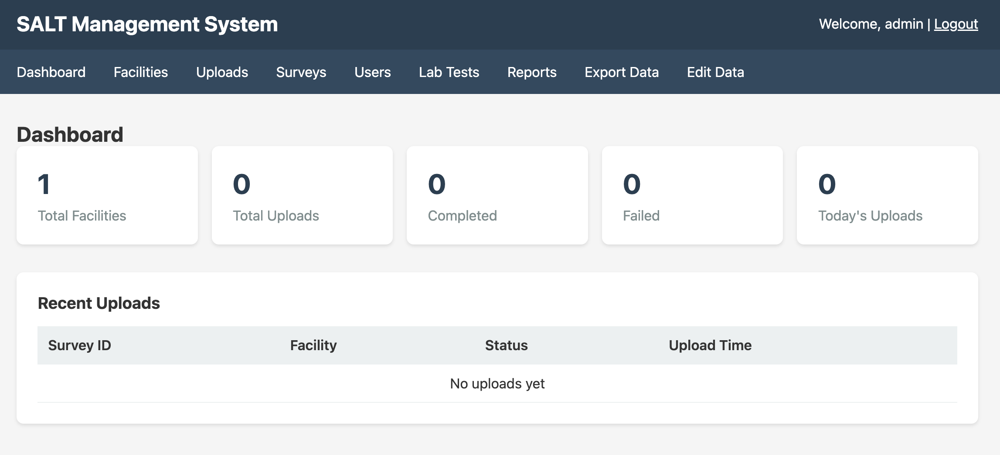

The dashboard is the first screen you see after logging in to the SALT management server. It provides an at-a-glance summary of data collection activity.

## Summary statistics

| Metric | Description |
|--------|-------------|
| **Total Facilities** | Number of registered facilities |
| **Total Uploads** | All survey uploads ever received |
| **Completed** | Uploads that passed validation and were stored successfully |
| **Failed** | Uploads that were rejected due to validation errors |
| **Today's Uploads** | Uploads received in the current calendar day |

## Recent Uploads table

Below the summary statistics, a table lists the most recent survey uploads with:

- **Survey ID**: internal identifier of the survey definition
- **Facility**: the facility that submitted the upload
- **Participant ID**: the unique participant identifier assigned by the tablet
- **Status**: `completed` or `failed`
- **Upload Time**: server timestamp of when the upload was received

Clicking a row opens the upload detail view (if available).

## Navigation

The left sidebar provides access to all management sections:

- **Facilities**: manage participating sites
- **Uploads**: full upload history and error details
- **Surveys**: survey builder and configuration
- **Users**: manage administrator accounts
- **Lab Tests**: configure and enter laboratory results
- **Reports**: create and schedule analytical reports
- **Export Data**: download survey data
- **Edit Data**: soft-delete subjects or correct individual responses
