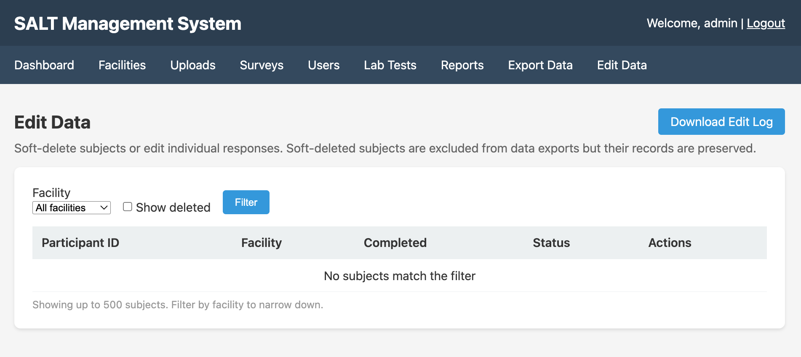

The Edit Data page allows authorised administrators to make limited corrections to collected data without breaking the audit trail.

## What you can do

| Action | Description |
|--------|-------------|
| **Soft-delete a subject** | Mark a participant's entire record as deleted. The data is retained in the database but excluded from exports and counts by default. |
| **Edit individual responses** | Correct the value of a specific question response for a specific participant. |

All changes are logged with a timestamp, the username of the administrator who made the change, the original value, and the new value.

## Participant table

The table shows participants with:

- **Participant ID** — unique identifier assigned by the tablet
- **Facility** — which facility the participant was enrolled at
- **Completed** — whether the interview was completed
- **Status** — `active` or `deleted`
- **Actions** — edit or delete

## Filtering

Use the **Facility** dropdown to filter by facility. Check **Show deleted** to include soft-deleted records in the list.

## Soft-deleting a participant

Click the delete icon next to a participant and confirm. The participant's status changes to `deleted`. Deleted participants:

- Are excluded from exports by default (unless **Show deleted** is enabled and you re-export)
- Are retained in the database with all their responses intact
- Can be restored by an administrator

## Editing a response

Click the edit icon next to a participant to see their responses. Click the pencil icon next to any response to change its value. Enter the corrected value and provide a reason for the edit. The original value is preserved in the audit log.

## Edit log

Click **Download Edit Log** to download a CSV of all edits and deletions, including:

- Timestamp
- Administrator username
- Participant ID
- Field edited
- Original value
- New value
- Reason given

The edit log is the authoritative record of all post-collection corrections.

## When to use Edit Data

Use Edit Data sparingly and only for genuine data quality corrections — for example, a transcription error in a numeric response, or a test participant whose record should be excluded. Programmatic corrections to entire variables should be done in your analysis scripts, not in the database.
