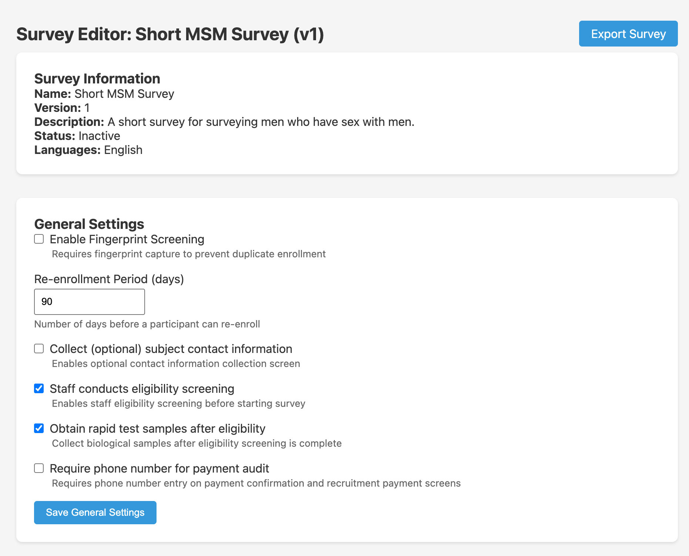
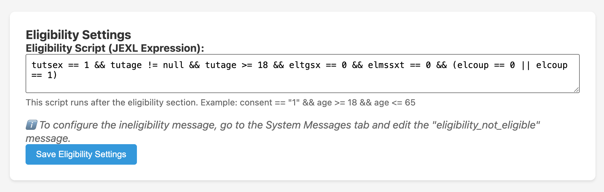

The eligibility section is a fixed set of questions at the start of every interview. After these questions are answered, a JEXL expression — the **Eligibility Script** — determines whether the participant meets the study's inclusion criteria. Ineligible participants are shown a customisable message and the interview ends.

## General settings for eligibility

The survey's General Settings tab controls how eligibility screening works:



| Setting | Description |
|---------|-------------|
| **Staff conducts eligibility screening** | If checked, the eligibility questions are administered by staff before the participant takes the self-interview. If unchecked, the participant answers eligibility questions themselves on the tablet. |
| **Enable Fingerprint Screening** | Whether the tablet checks the participant's fingerprint against previously enrolled participants to prevent duplicate enrolment. |
| **Re-enrollment Period** | Days after a participant's initial enrolment during which the fingerprint scanner will flag them as a duplicate (e.g. 90 days). After this period, the same person may be enrolled again. |

## The eligibility script

The eligibility script is a JEXL expression entered in the **Eligibility Settings** card of the survey editor:



The script may reference any question by its short name. It runs once, after all eligibility questions are answered. If the expression evaluates to `true`, the participant is eligible and the main interview begins. If `false`, the participant is shown the ineligibility message.

### Example eligibility script

```
tutsex == 1 && tutage != null && tutage >= 18 && eltgsx == 0 && elmssxt == 0
  && (elcoup == 0 || elcoup == 1)
```

This script from the CRANE MSM survey requires:
- `tutsex == 1` — second option for sex question (male)
- `tutage != null && tutage >= 18` — age provided and at least 18
- `eltgsx == 0` — first option for "ever had anal sex" (yes)
- `elmssxt == 0` — first option for "ever had sex with a man" (yes)
- `elcoup == 0 || elcoup == 1` — coupon valid (first or second option)

### Writing the eligibility script

See the full [Survey Logic](/management/survey-logic/) guide for:
- How option numbers work (starting at 0)
- How to combine conditions with `&&` and `||`
- How to handle unanswered questions (`!= null`)
- Common mistakes

## Questions in the eligibility section

Create eligibility questions the same way as other questions, but set their **Section** field to `Eligibility` in the question edit modal. These questions appear before the main interview and their answers are available to the eligibility script.

## Ineligibility message

The message shown to ineligible participants is configured on the **System Messages** tab. See [System Messages](/management/system-messages/).
