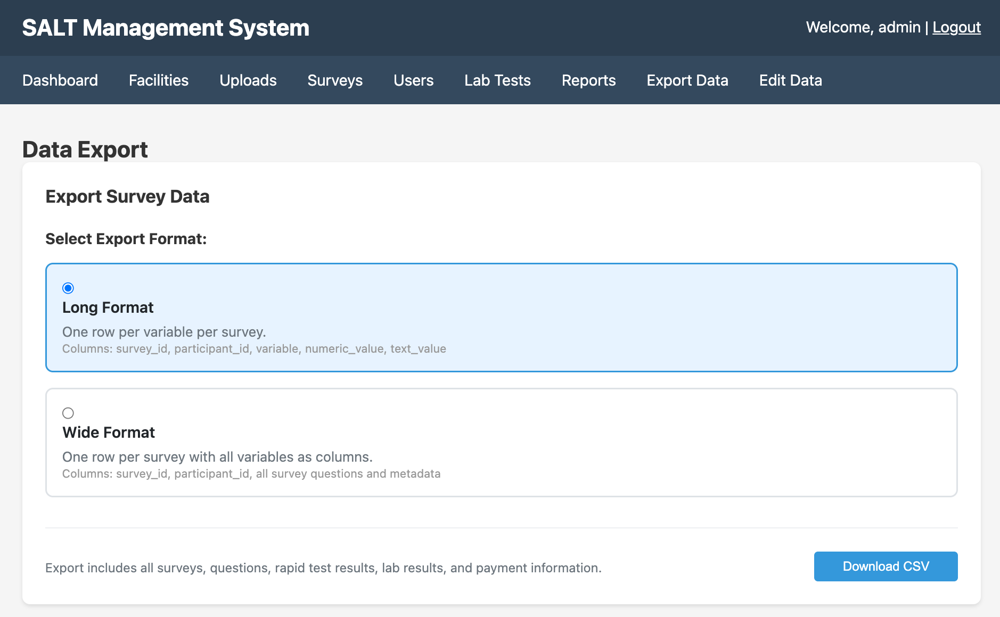
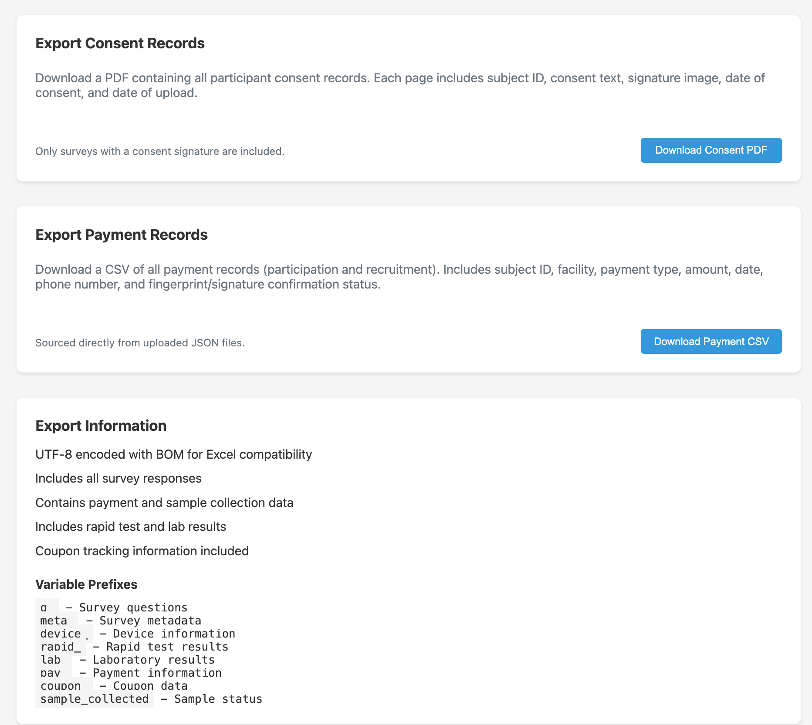

The Export Data page provides bulk downloads of all collected survey data.

## Export formats

SALT offers three formats:

| Format | Description |
|--------|-------------|
| **Long Format** | One row per question-response pair. Suitable for analysis tools that expect tidy data. |
| **Wide Format** | One row per participant, one column per variable. Suitable for SPSS, Stata, or R data frames. |
| **RDS Format** | Wide format with additional columns formatted for input to RDS estimators. |

Select a format and click **Download CSV**.

The download includes all surveys, questions, rapid test results, lab results, payment information, and metadata across all facilities.

## Variable naming conventions

| Prefix | Variables |
|--------|-----------|
| `q_` | Question responses (keyed by short name, e.g. `q_age`, `q_sex`) |
| `meta_` | Metadata: participant ID, facility, upload timestamp, survey version |
| `device_` | Device information: tablet ID, app version |
| `rapid_` | Rapid test results (e.g. `rapid_hivrapid`, `rapid_syprapid`) |
| `lab_` | Laboratory test results (e.g. `lab_HIVCONFIRM`, `lab_CD4`) |
| `pay_` | Payment information: amount, type, audit status |
| `coupon_` | Coupon chain data: recruiter ID, coupon code used |
| `sample_collected` | Whether a biological sample was collected |

## Consent records

Click **Download Consent PDF** to download a PDF containing all consent records. Consent records include the participant ID, facility, date, and any consent-related survey responses.

## Payment records

Click **Download Payment CSV** to download a CSV of all payment records, including recruitment payments. This is useful for financial audit and programme reporting.

## Edit log

The [Edit Data](/management/edit-data/) page has a **Download Edit Log** button that provides a full audit trail of all edits and soft-deletions applied to collected data.

## Filtering

The export currently includes data across all facilities and all time. To filter by facility or date range, use R or another analysis tool on the downloaded CSV, or use the Quarto-based [Reports](/management/reports/) engine to generate filtered outputs.
