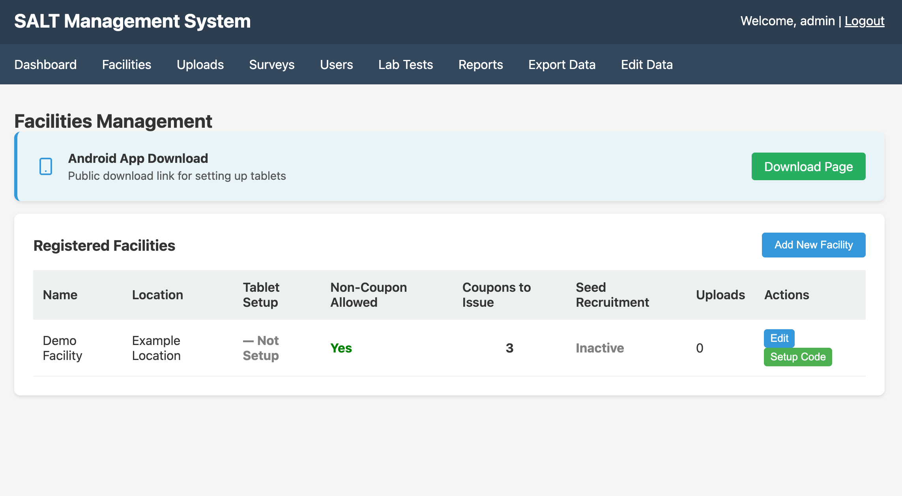
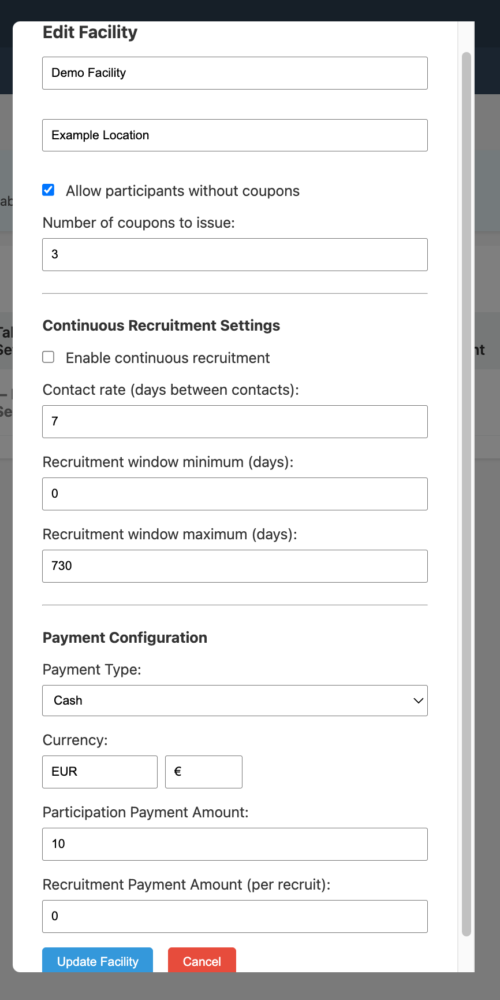

Facilities represent the health sites where data collection takes place. Each facility has its own API key and configuration, and tablets are registered to a specific facility.

## Facility list

The facilities page shows all registered facilities with:

- **Name** — the facility's display name
- **Location** — geographic location or site description
- **Setup** — whether the facility has been set up on at least one tablet
- **Allow without coupons** — whether participants may be enrolled without presenting a coupon
- **Coupons** — number of coupons issued per participant
- **Seed Recruitment** — whether seed recruitment (participants without coupons) is active

## Adding a facility

Click **Add Facility** and complete the form:

- **Name** — display name for the facility
- **Location** — e.g. city, district, or clinic name

## Editing a facility

Click the edit icon next to a facility to open the edit modal:

### Basic settings

| Field | Description |
|-------|-------------|
| **Name** | Facility display name |
| **Location** | Geographic description |
| **Allow without coupons** | If checked, participants may be enrolled even if they have no referral coupon |
| **Number of coupons** | How many coupons each enrolled participant receives to recruit others (typically 3) |

### Continuous recruitment settings

| Field | Description |
|-------|-------------|
| **Contact rate** | Expected days between a participant receiving a coupon and presenting at the facility (used in diagnostics) |
| **Recruitment window min** | Earliest day a coupon is considered valid (0 = same day it was issued) |
| **Recruitment window max** | Latest day a coupon is considered valid (e.g. 730 = up to 2 years) |

### Payment settings

| Field | Description |
|-------|-------------|
| **Payment Type** | `Cash` or other payment methods configured in the system |
| **Currency** | ISO currency code and symbol (e.g. EUR €) |
| **Participation Payment** | Amount paid to each enrolled participant |
| **Recruitment Payment** | Amount paid to the person who recruited this participant (paid when the recruit presents their coupon) |

## Setup code

Before connecting a tablet to a facility, you need to generate a one-time setup code:

1. Click **Setup Code** next to the facility
2. A 6-character alphanumeric code is displayed
3. Enter this code on the tablet during the setup wizard

Setup codes expire after 24 hours. Generate a new one if the previous code expires before the tablet is set up.

## Downloading the tablet APK

The **Download APK** button (shown on the facilities page) links to the Android APK file served from the management server. You can also browse to `https://your-server/files/salt.apk` directly from the tablet.

## Deleting a facility

Click the delete icon next to a facility. Deleting a facility does not delete uploaded survey data — historical uploads are retained.
