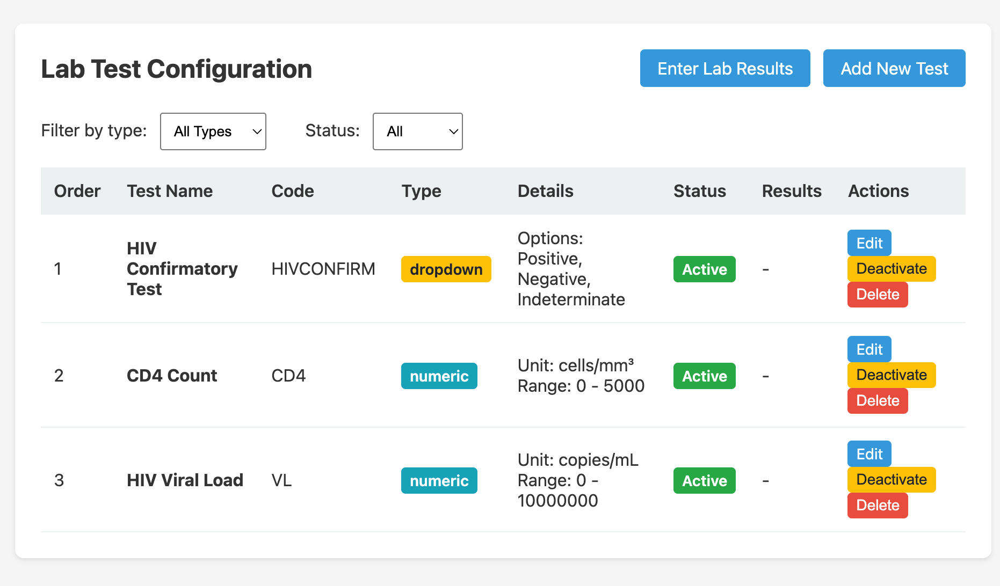
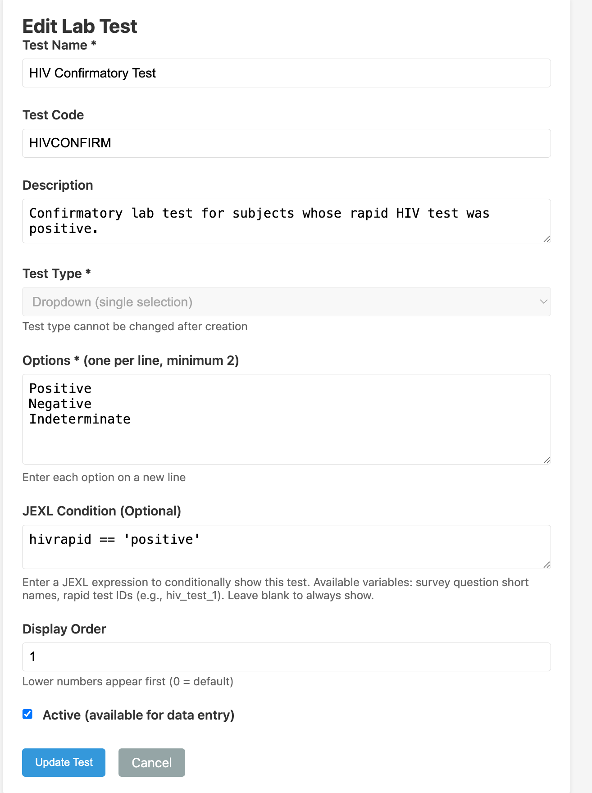
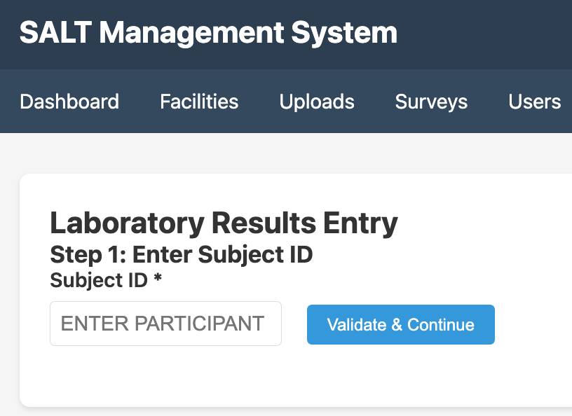

Laboratory tests are confirmatory tests performed on samples collected at the facility. SALT stores lab results alongside survey data and can make them available in exports. Lab tests are distinct from rapid tests — rapid tests are point-of-care results entered during the interview, while lab tests are entered later by laboratory staff.

## Lab test configuration

The lab test list shows all configured tests:

| Column | Description |
|--------|-------------|
| **Name** | Display name (e.g. HIV Confirmatory Test) |
| **ID** | Short identifier used in exports (e.g. `HIVCONFIRM`) |
| **Type** | `dropdown` (fixed options) or `numeric` (a number with units and range) |
| **Condition** | JEXL expression that determines when this test is applicable |
| **Active** | Whether this test is currently in use |

### Default lab tests

The first-boot seed creates three lab tests:

- **HIV Confirmatory Test** (`HIVCONFIRM`) — dropdown: Positive / Negative / Indeterminate. Condition: `hivrapid == 'positive'`
- **CD4 Count** (`CD4`) — numeric, 0–5 000 cells/mm³
- **HIV Viral Load** (`VL`) — numeric, 0–10 000 000 copies/mL

## Adding or editing a lab test

Click **Add New Test** or the edit icon to open the edit modal:

| Field | Description |
|-------|-------------|
| **Test Name** | Display name |
| **Test ID** | Short identifier (used in export column names, prefixed with `lab_`) |
| **Type** | `dropdown` or `numeric` |
| **Options** | For dropdown: the list of result options (e.g. Positive, Negative, Indeterminate) |
| **Minimum / Maximum** | For numeric: the valid range |
| **Units** | For numeric: the unit of measurement (e.g. cells/mm³) |
| **Condition** | JEXL expression. This lab test is displayed only when the condition is true. Leave blank to always display. |
| **Display Order** | Order among lab tests in the entry interface |
| **Active** | Uncheck to hide this test from the entry interface without deleting it |

## Entering lab results

Click **Enter Lab Results** to open the results entry workflow:

**Step 1 — Enter Subject ID**: Type or scan the participant's ID (as printed on their sample label) and click **Validate & Continue**.

**Step 2 — Enter results**: For each applicable lab test, enter the result. Only tests whose condition expression evaluates to true for this participant's rapid test results are shown.

**Step 3 — Save**: Results are stored against the participant record and become available in data exports.

## Lab results in exports

Lab results appear in the export with the prefix `lab_` followed by the test ID (e.g. `lab_HIVCONFIRM`, `lab_CD4`, `lab_VL`). See [Export Data](/management/export-data/).

## Who can enter lab results

Users with the **Lab Staff** role can enter lab results. Administrators can also enter results. Survey staff do not have access to the lab results entry interface.
