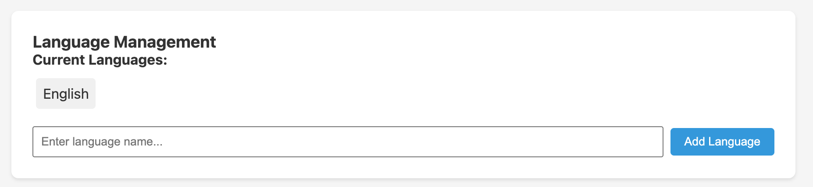

SALT supports multi-language surveys with audio playback (ACASI — Audio Computer-Assisted Self-Interview). Participants choose their preferred language on the tablet and hear questions and options in that language.

## Current languages

The Languages tab shows the languages currently configured for the survey. **English** is the default language and is always present.

## Adding a language

1. Type the language name in the **Enter language name** field (e.g. `Armenian`, `French`, `Amharic`)
2. Click **Add Language**

The new language appears in the language list. You can then record audio for each question and option in that language.

## Recording audio

Once a language is added, it becomes available in the question edit modal. Each question and each answer option has a **Record** button for every configured language. Click the button to record audio in the browser using your computer's microphone.

Audio is stored as MP3 in the survey definition and downloaded to tablets during sync. Tablets play the audio automatically as each question appears.

## Audio requirements for production

Audio recording uses the browser's MediaRecorder API, which requires an **HTTPS connection**. Audio recording will not work over plain HTTP. Ensure your server has a valid TLS certificate before recording audio for production use.

## Language selection on the tablet

When a staff member starts a new survey on the tablet, they can select the participant's preferred language if more than one language is configured. The tablet then plays all audio in the selected language.

## Removing a language

Removing a language from the survey definition removes its audio from future tablet syncs. Existing upload data that was collected in that language is retained.

## Export

Exported data columns are language-independent — question answers are stored by question short name and option index, not by the language text. Audio files are included in the survey export bundle as base64-encoded data in the `audio_files_json` field.
