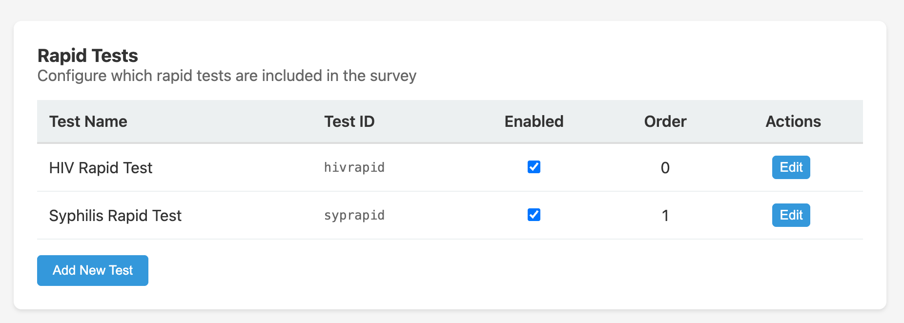

Rapid tests are point-of-care tests administered at the facility immediately after a participant is confirmed eligible. SALT tracks which tests were offered and the result of each, and can make test results available in survey skip logic.

## Rapid test list

The Rapid Tests tab in the survey editor shows all configured rapid tests:

| Column | Description |
|--------|-------------|
| **Name** | Display name of the test (e.g. HIV Rapid Test) |
| **ID** | Short identifier used in skip logic expressions (e.g. `hivrapid`) |
| **Enabled** | Whether this test is currently offered |
| **Order** | Display order to staff during the interview |

The default configuration includes:

- **HIV Rapid Test** (`hivrapid`), order 0, enabled
- **Syphilis Rapid Test** (`syprapid`), order 1, enabled

## Adding a rapid test

Click **Add New Test** and fill in:

- **Test Name**: the name shown to staff
- **Test ID**: a short alphanumeric identifier (used in skip logic and exports)
- **Enabled**: whether the test is active
- **Display Order**: order among the rapid tests panel

## Rapid test results in skip logic

Rapid test results are available in skip logic and in lab test conditions using the test ID. For example, the HIV Confirmatory lab test is configured to show only when `hivrapid == 'positive'`. Possible result values are `'positive'`, `'negative'`, and `'indeterminate'`.

## Relationship to lab tests

Rapid tests collect an initial screening result at the point of care. Confirmatory laboratory tests can be configured separately in [Lab Tests](/management/lab-tests/) and tied to rapid test results using JEXL conditions.

## Survey general settings

Whether rapid tests are collected at all is controlled by the **Obtain rapid test samples after eligibility** toggle on the survey's General Settings tab. If this is disabled, no rapid tests are offered regardless of the configuration here.
