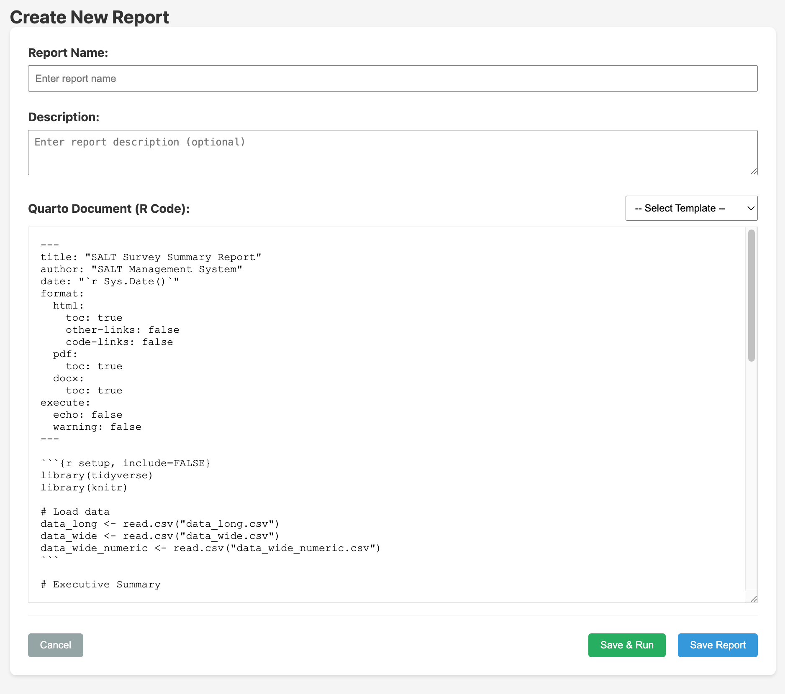
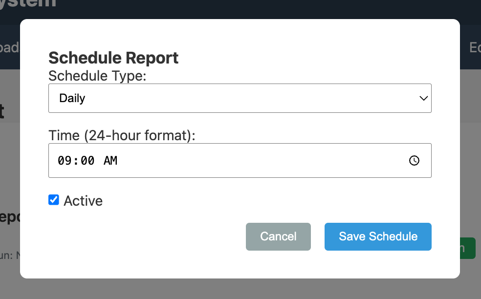
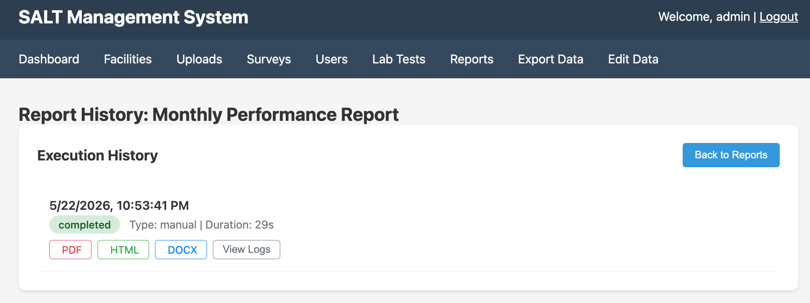

SALT includes a reports engine that runs Quarto documents against the live database. Reports can be run on-demand or scheduled to run automatically.

## Creating a report

Click **Create New Report**:

| Field | Description |
|-------|-------------|
| **Report Name** | Display name |
| **Description** | Optional description of what the report covers |
| **Quarto Document** | The R/Quarto source code for the report. A template selector provides starting points. |

The report code does **not** access the SQLite database directly. Instead, the server exports the survey data into the report's working directory before each run, in the same formats produced by the [Export Data](/management/export-data/) tab. The following CSV files are available to read with `read.csv()` / `readr::read_csv()`:

| File | Contents |
|------|----------|
| `data_long.csv` | One row per answer (long format) |
| `data_wide.csv` | One row per completed survey, answer labels as values |
| `data_wide_numeric.csv` | One row per completed survey, option indices as values |

R packages including `RDS`, `tidyverse`, `lubridate`, `scales`, `jsonlite`, and `uuid` are available.

Click **Save & Run** to save and execute immediately, or **Save Report** to save without running.

## Scheduling

Click the **Schedule** icon next to any report:

| Field | Description |
|-------|-------------|
| **Schedule Type** | `Daily`, `Weekly`, or `Monthly` |
| **Time** | Time of day to run (e.g. 09:00 AM) |
| **Active** | Toggle on or off without deleting |

## Run history

For each run: date, type (manual or scheduled), duration, and download links for PDF / HTML / DOCX output. **View Logs** shows the full Quarto render log.

Completed outputs are stored in `data/reports/runs/` on the server volume.

## R packages available

- `RDS` — Respondent-Driven Sampling estimators
- `tidyverse` — data manipulation and visualisation
- `lubridate`, `scales`, `jsonlite`, `uuid` — utilities
