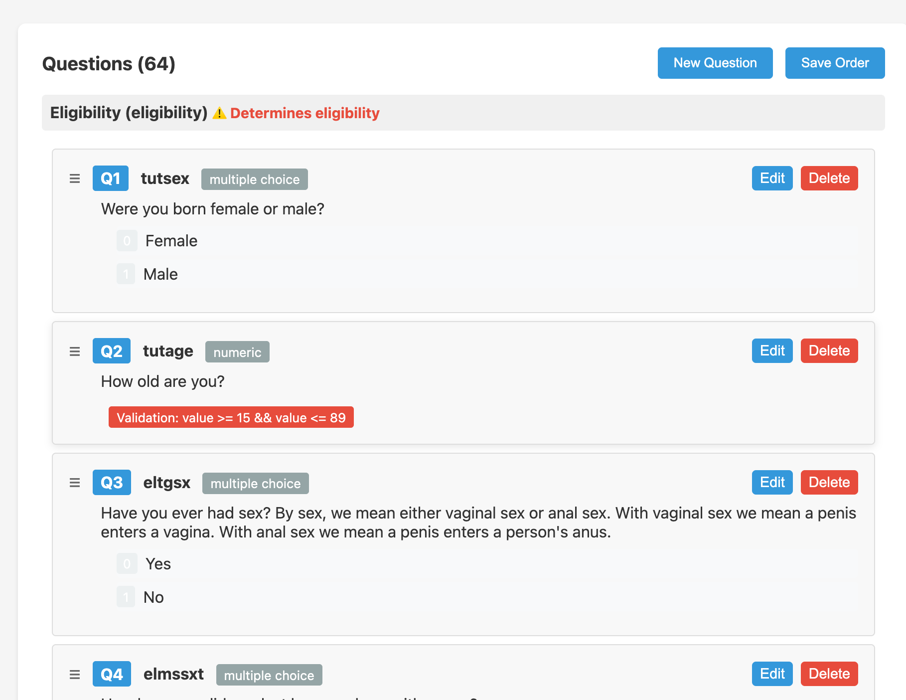
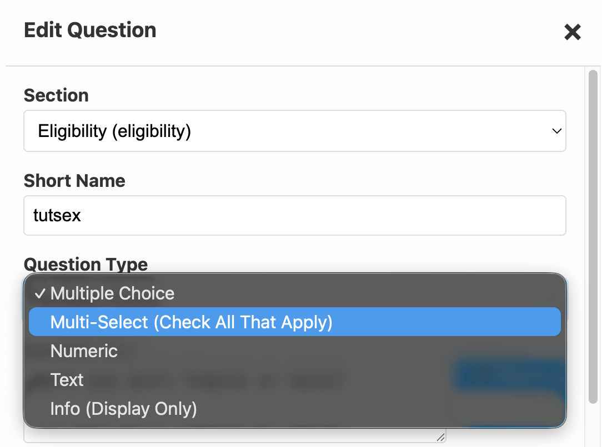
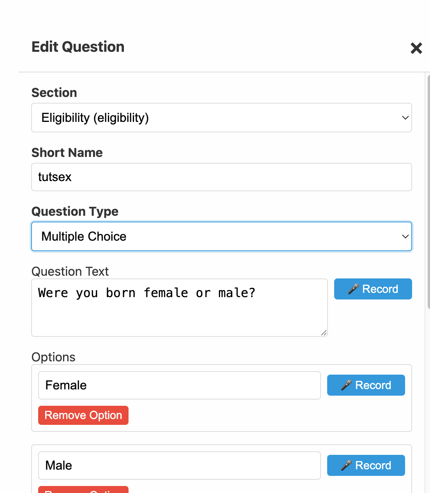
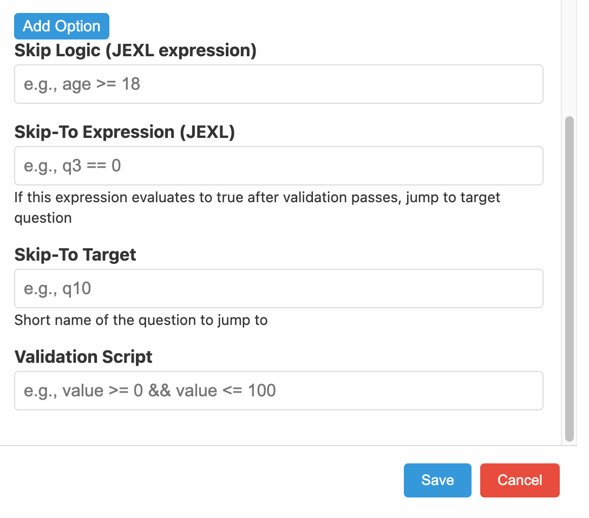

Questions are the building blocks of a SALT survey. Each question has a type, display text, answer options (for choice questions), and optional logic fields.

## Question list

The questions tab of the survey editor shows all questions in order, grouped by section. Each row shows:

- **Order**: drag to reorder
- **Short Name**: the unique identifier used in skip logic and data export
- **Type**: question type (see below)
- **Question text**: the first-language text displayed to participants
- Actions: **Edit**, **Delete**

## Question types

SALT supports five question types:

| Type | Description |
|------|-------------|
| **Multiple Choice** | Participant selects exactly one option from a list |
| **Multi-Select (Check All That Apply)** | Participant selects one or more options; min/max constraints can be set |
| **Numeric** | Participant enters a number; validated with a JEXL expression |
| **Text** | Participant types a short text response |
| **Info (Display Only)** | Displays text (and optionally audio) without collecting an answer |

## The question edit modal

Click **Edit** on any question to open the edit modal.

### Top half, question definition

| Field | Description |
|-------|-------------|
| **Section** | Which section of the survey this question belongs to (e.g. Eligibility, Main) |
| **Short Name** | Unique machine-readable identifier. Used in skip logic, data column names, and exports. Must be unique within the survey. Cannot be `value`. |
| **Question Type** | Select from the five types above |
| **Question Text** | The question displayed to participants in the default language |
| **Options** | For Multiple Choice and Multi-Select: the list of answer options, in the order they appear. Each option has a **Record** button to record audio. |
| **Min / Max Selections** | For Multi-Select only: the minimum and maximum number of options the participant must select |

### Bottom half, logic fields

| Field | Description |
|-------|-------------|
| **Skip Logic** | JEXL expression. When this evaluates to `true`, the question is hidden. |
| **Skip-To Expression** | JEXL expression. When true after this question is answered, the survey jumps to the Skip-To Target. |
| **Skip-To Target** | Short Name of the question to jump to when Skip-To Expression is true. |
| **Validation Script** | JEXL expression. The participant's answer is in `value`. The answer is accepted when this evaluates to `true`. |

See [Survey Logic](/management/survey-logic/) for a complete guide to writing these expressions.

## Option numbering

Options are numbered **starting at 0**, not 1. The first option in the list is option `0`, the second is `1`, and so on. This is the most common source of errors in skip logic, always double-check option numbers when writing conditions.

## Sections

Questions are organised into named sections. Sections appear as groupings in the editor and can be used to structure the interview flow (e.g. an Eligibility section followed by a Main section).

## Audio recording

Each question and each option has a **Record** button. Click it to record audio in the browser using your microphone. Recorded audio is stored in the survey definition and downloaded to tablets during sync. See [Languages](/management/languages/) for multi-language audio.

## Saving

Click **Save** in the edit modal. Questions are saved immediately to the server, there is no separate publish step for individual questions.
