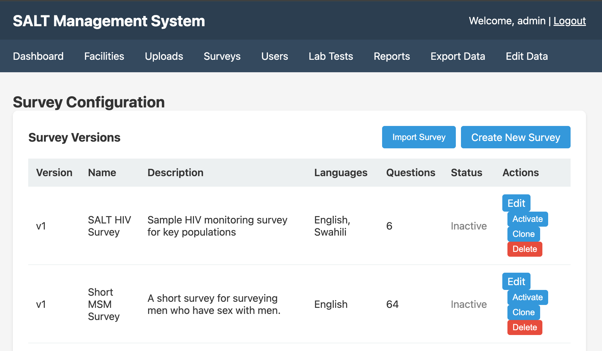

Surveys are the central configuration unit in SALT. A survey definition includes all questions, options, skip logic, eligibility criteria, system messages, rapid tests, and language settings.

## Survey list

The surveys page shows all surveys in the system:

| Column | Description |
|--------|-------------|
| **Name** | Survey display name and version number |
| **Status** | `active`, tablets will sync and use this survey; `inactive`, draft or retired |
| **Questions** | Total number of questions in the survey |

Only one survey can be **active** at a time. Tablets download the active survey during sync.

## Creating a survey

Click **Create New Survey** to open a blank survey editor. You will need to:

1. Set a survey name
2. Configure general settings (fingerprint screening, eligibility, rapid tests)
3. Add questions, options, and skip logic
4. Set system messages
5. Configure languages and audio
6. Activate the survey when ready

## Survey editor tabs

When editing a survey, the editor is divided into tabs:

| Tab | Purpose |
|-----|---------|
| **Questions** | Add, edit, reorder, and delete questions and answer options |
| **General Settings** | Fingerprint screening, re-enrollment period, eligibility screening, rapid tests, payment audit |
| **System Messages** | Customise the ineligibility message and other participant-facing text |
| **Rapid Tests** | Configure which rapid tests are offered after eligibility |
| **Languages** | Add language support and record audio for questions and options |
| **Eligibility** | Write the JEXL eligibility script |

## Activating a survey

Set a survey's status to **Active** in the survey list or within the editor. Tablets will download the newly activated survey on their next sync.

When you activate a new survey version, tablets already in the field will pick it up on their next sync. Surveys collected with the old version are retained in the database with their original version identifier.

## Versioning

Survey names may include a version number (e.g. `Short MSM Survey v1`). If you import a survey with a name that already exists, the version number is automatically incremented.

## Importing a survey

Click **Import Survey** to upload a previously exported survey JSON bundle. See [Import & Export Surveys](/management/import-export/) for details.

## Deleting a survey

Surveys can be deleted from the list. Deleting a survey definition does not delete already-collected data, uploaded responses retain a reference to the survey version they were collected under.
