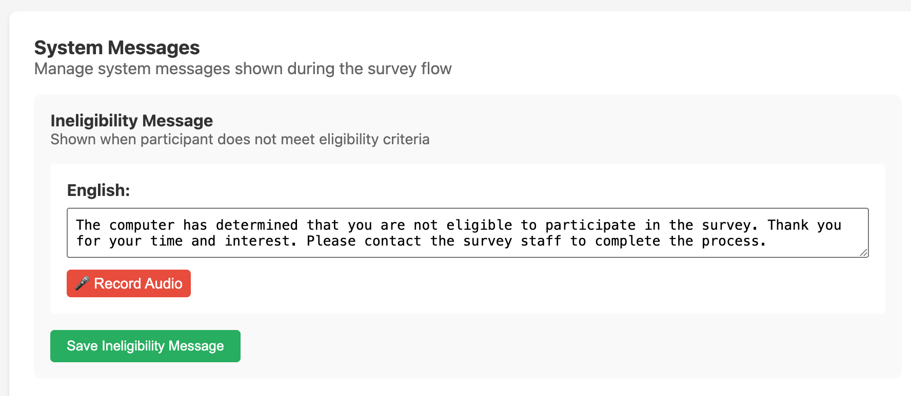

System messages are participant-facing texts that SALT displays at fixed points in the interview workflow. They are configured per survey so you can tailor them to your study population and local language. Each message can be entered as text and optionally recorded as audio for each survey language.

## Standard messages

Every survey has the following five standard system messages:

| Title | Message key | When it is shown |
|-------|-------------|------------------|
| **Ineligibility Message** | `eligibility_not_eligible` | Shown to participants who do not meet the eligibility criteria defined in the Eligibility Script |
| **Staff Validation Message** | `staff_validation` | Shown when staff need to validate completion of a workflow step |
| **Payment Confirmation Message** | `payment_confirmation` | Shown on the payment confirmation screen before the participant receives payment |
| **Consent Agreement** | `consent_agreement` | Consent text and audio read to the participant before signature capture |
| **Coupon Instructions** | `coupon_instructions` | Shown to the participant on the Referral Coupons screen, explaining how to use their coupons |

## Rapid-test instructions

In addition to the standard messages, each enabled rapid test produces its own per-survey instruction message. The message key follows the pattern `<testId>_rapid_test_instruction` (for example, `hiv_rapid_test_instruction`). These are shown on the rapid-test instruction screen on the tablet, before the staff member performs or records the test.

See [Rapid Tests](/management/rapid-tests/) for how to enable a rapid test on a survey.

## Editing a message

1. Open the survey editor and click the **System Messages** tab.
2. For the message you want to edit, enter the text in the text area for each language.
3. Click **Record Audio** to record an audio version of the message in the browser.
4. Click **Save** for that message.

A message is optional: leave the text blank and SALT will fall back to a built-in default for that screen.

## Multi-language messages

If your survey has multiple languages configured (see [Languages](/management/languages/)), each language has its own text field and **Record Audio** button on the System Messages tab. Participants hear the audio for the language selected on their tablet.

## Audio playback

On the tablet, system messages with recorded audio play automatically when the relevant screen appears. A **Replay** button allows staff or participants to play the audio again if needed.

## Relationship to other tabs

- The **Ineligibility Message** is displayed when the **Eligibility Script** (on the Eligibility tab) evaluates to `false`. See [Eligibility](/management/eligibility/) and [Survey Logic](/management/survey-logic/) for details on writing eligibility conditions.
- The **Consent Agreement** drives the consent instruction and signature screens on the tablet.
- The **Coupon Instructions** drive the coupon-issued screen the participant sees at the end of the survey.
- Each `<testId>_rapid_test_instruction` drives the corresponding rapid-test instruction screen.
