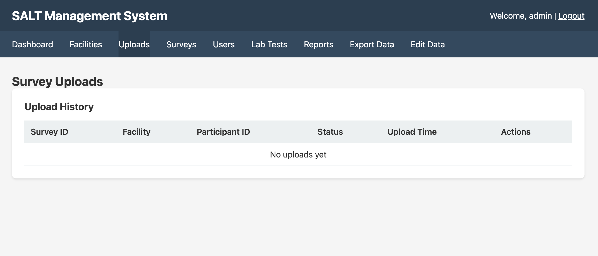

The Uploads page shows every survey submission received from tablets, along with its processing status.

## Upload history table

| Column | Description |
|--------|-------------|
| **Survey ID** | The survey definition that was used |
| **Facility** | The facility whose tablet submitted this upload |
| **Participant ID** | The unique participant identifier assigned by the tablet at enrolment |
| **Status** | `completed`, stored successfully; `failed`, rejected |
| **Upload Time** | Server timestamp when the upload was received |
| **Actions** | View details or download the raw JSON |

## Upload statuses

**Completed**: the upload passed all validation checks and the response data was written to the database. The participant's answers, rapid test results, payment information, and coupon data are all available for export.

**Failed**: the upload was rejected. Common causes:
- Missing required fields in the submission
- Survey version mismatch (tablet is running an older survey than the server)
- Duplicate participant ID (if fingerprint screening is enabled, this is caught on the tablet before upload)
- Malformed JSON payload

## Viewing upload details

Click the **View** action on any row to see the full upload payload, including:

- Raw response data keyed by question short name
- Rapid test results
- Payment records
- Coupon assignments
- Device metadata (tablet ID, app version, upload timestamp)

## Failed uploads

For failed uploads, the detail view shows the specific validation error that caused the rejection. Common next steps:

- If the error is a survey version mismatch, ensure the tablet has synced the latest survey
- If the error is a missing field, check the tablet app version and update if needed
- Raw upload JSON can be downloaded for manual inspection

## Upload volume

Total upload counts appear on the [Dashboard](/management/dashboard/) summary panel. The dashboard also shows today's uploads and a running total of completed vs. failed submissions.
