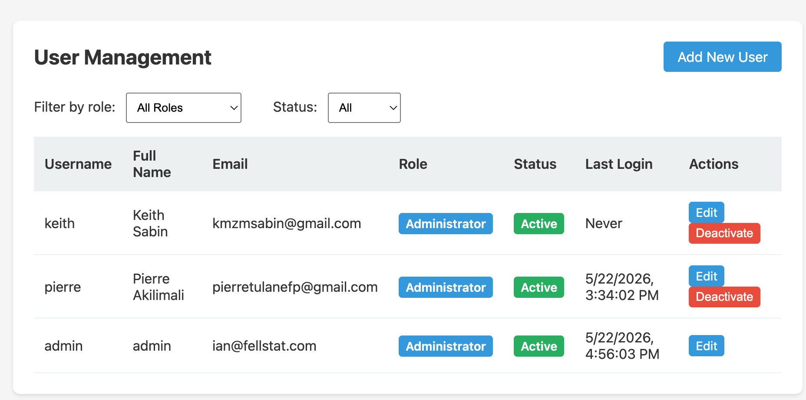

The Users page manages accounts for the management server web interface. These are separate from tablet user accounts, which are managed on each tablet individually.

## User list

The user list shows all management server accounts:

| Column | Description |
|--------|-------------|
| **Username** | Login username |
| **Role** | `Administrator` is the only current role for management server users |
| **Status** | `Active` or `Inactive` |

## Roles

### Administrator

Full access to all management server features: survey configuration, facility management, data export, report generation, and user management.

### Lab Staff

Access to the laboratory results entry workflow only. Lab Staff users can enter and view lab results but cannot access survey configuration, exports, or administrative settings.

## Adding a user

Click **Add New User** and fill in:

- **Username** — used to log in
- **Full Name** — display name
- **Password** — temporary password (user should change it after first login)
- **Role** — `Administrator` or `Lab Staff`

## Filtering

Use the **role** and **status** filter dropdowns to narrow the list.

## Editing a user

Click **Edit** next to a user to change their full name, role, or status. Passwords cannot be viewed — only reset.

## Resetting a password

Click **Reset Password** next to a user to set a new temporary password. The user should change this password at next login.

## Deactivating a user

Set a user's status to **Inactive** to prevent them from logging in without deleting their account and audit history.

## Relationship to tablet users

Tablet user accounts (ADMINISTRATOR and SURVEY_STAFF) are managed separately on each individual tablet. See [Tablet Administrator Guide](/tablet/admin-guide/) for details.
