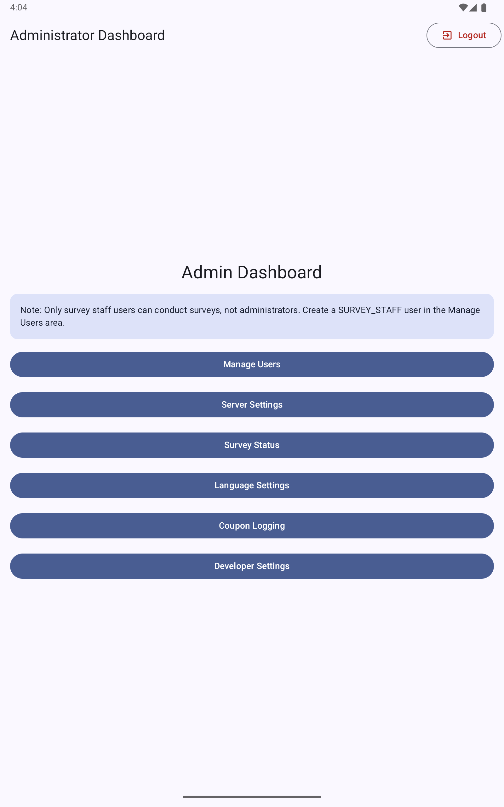
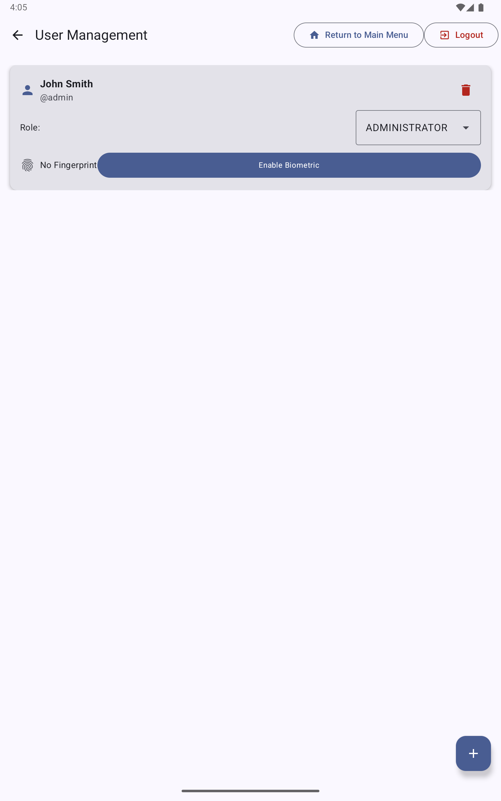
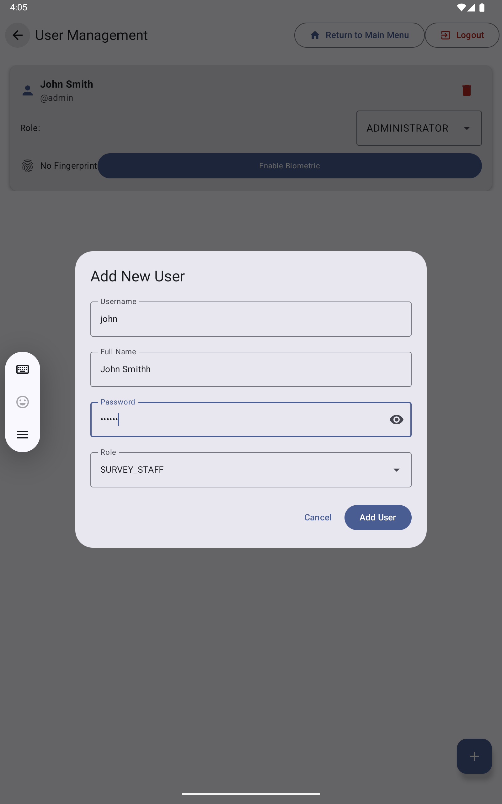
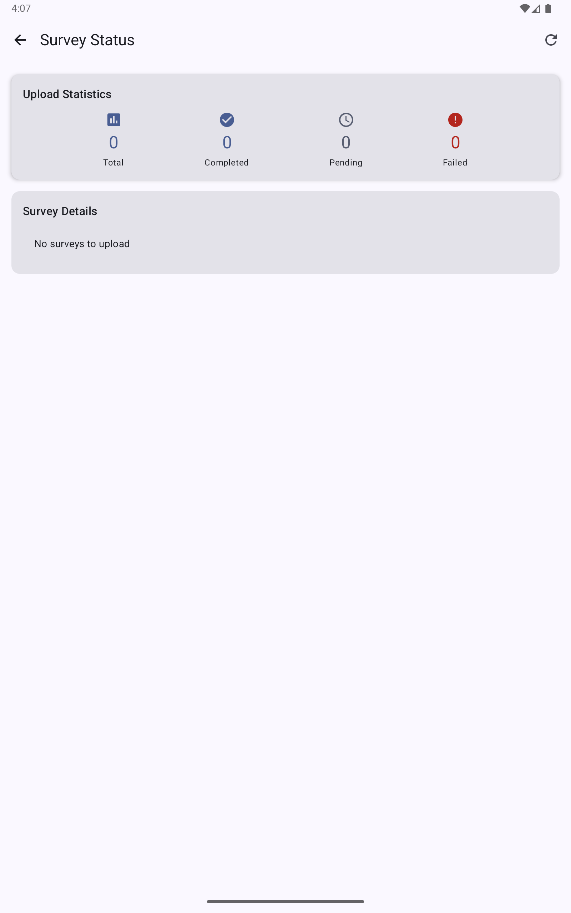
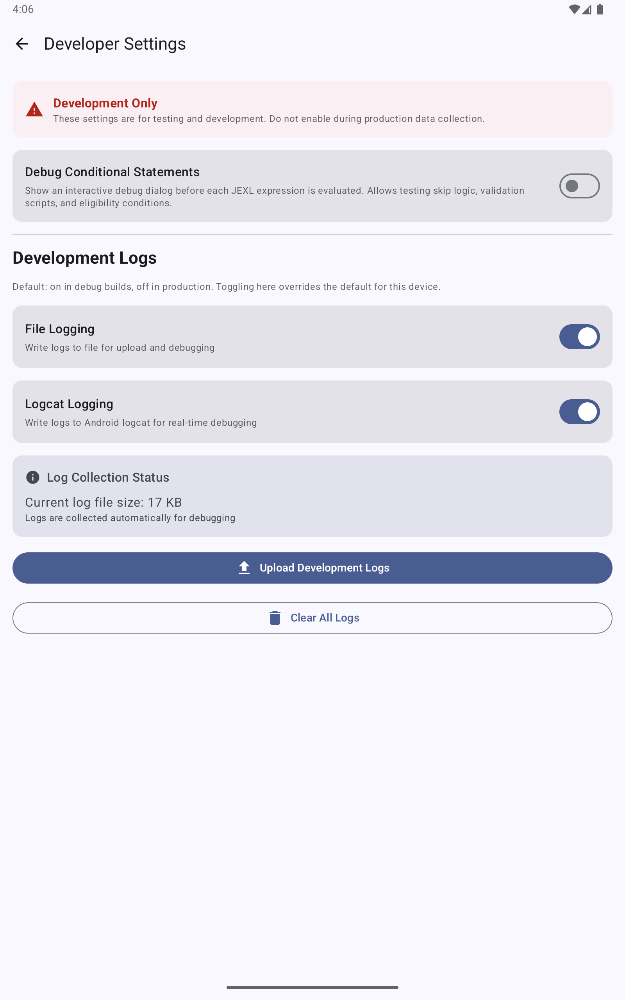

The tablet Administrator Dashboard is accessible only to users with the `ADMINISTRATOR` role on the tablet. It provides user management, server settings, survey diagnostics, and developer tools.

## Accessing the admin dashboard

Log in to the tablet with administrator credentials. The **Administrator Dashboard** appears with the following options:

- **Manage Users**: add, edit, and delete tablet user accounts
- **Server Settings**: view and update the server URL and API key
- **Survey Status**: view upload statistics and queue
- **Language Settings**: configure the tablet's display language
- **Coupon Logging**: view the coupon chain log
- **Developer Settings**: debugging tools for survey logic testing

## Managing users

Tap **Manage Users** to see all tablet user accounts:

Each user card shows:
- Username and display name
- Role (ADMINISTRATOR or SURVEY_STAFF)
- Fingerprint status (enrolled or not enrolled)

### Adding a user

Tap the **+** button to add a new user:

Fill in:
- **Username**: at least 3 characters
- **Full Name**: display name
- **Password**: at least 3 characters
- **Role**: `ADMINISTRATOR` or `SURVEY_STAFF`

Tap **Add User**. The new user can log in immediately.

> **Note**: Only SURVEY_STAFF users can conduct surveys. Administrators are locked out of the survey workflow to prevent conflicts of interest. Create at least one SURVEY_STAFF account before data collection begins.

### Enrolling a fingerprint

After adding a user, tap **Enable Biometric** on their user card to enroll their fingerprint. The SecuGen HU20-A scanner must be connected via USB OTG. Follow the prompts to capture the fingerprint.

### Changing a user's role

Tap the **Role** dropdown on a user card and select the new role. The change takes effect immediately.

### Deleting a user

Tap the trash icon on a user card to delete the account. Deleting a user does not delete any survey data they collected.

## Survey Status

Tap **Survey Status** to see upload statistics:

| Statistic | Description |
|-----------|-------------|
| **Total** | All completed surveys on this tablet |
| **Completed** | Successfully uploaded to the server |
| **Pending** | Waiting to upload (no connectivity or retry in progress) |
| **Failed** | Upload failed after multiple retries |

Tap the refresh icon to update the counts. The app retries failed uploads automatically when connectivity is restored.

## Server Settings

Tap **Server Settings** to view or change:

- **Server URL**: the URL of the management server
- **Facility API Key**: the key that authenticates this tablet to the server

These are set during initial tablet setup and should not need to change unless the server is moved.

## Developer Settings

Tap **Developer Settings** for diagnostic tools:

| Setting | Description |
|---------|-------------|
| **Debug Conditional Statements** | Shows an interactive debug dialog before each JEXL expression is evaluated. Use this to test skip logic, validation scripts, and eligibility conditions. Turn off before real data collection. |
| **File Logging** | Write log events to a file on the device |
| **Logcat Logging** | Write log events to Android logcat for real-time debugging via Android Studio |

The **Upload Development Logs** button sends the device log file to the server for remote debugging.

**Important**: Always turn off Debug Conditional Statements before beginning real data collection. It interrupts every condition evaluation with a dialog that staff will need to dismiss.
