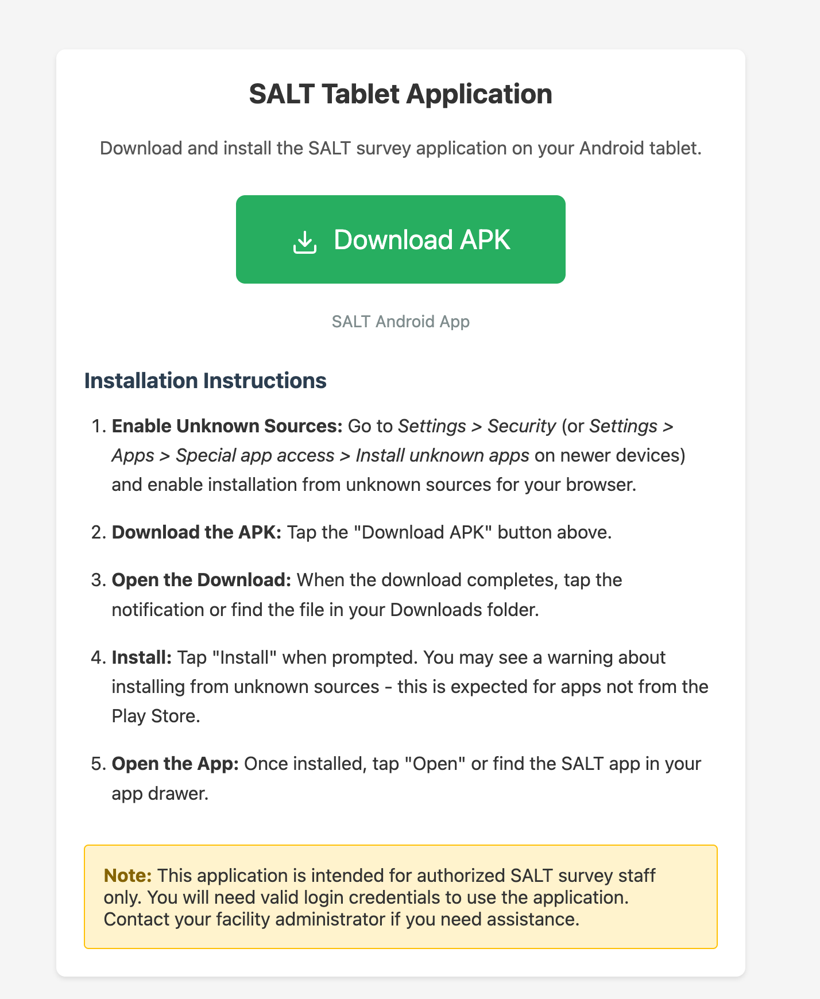
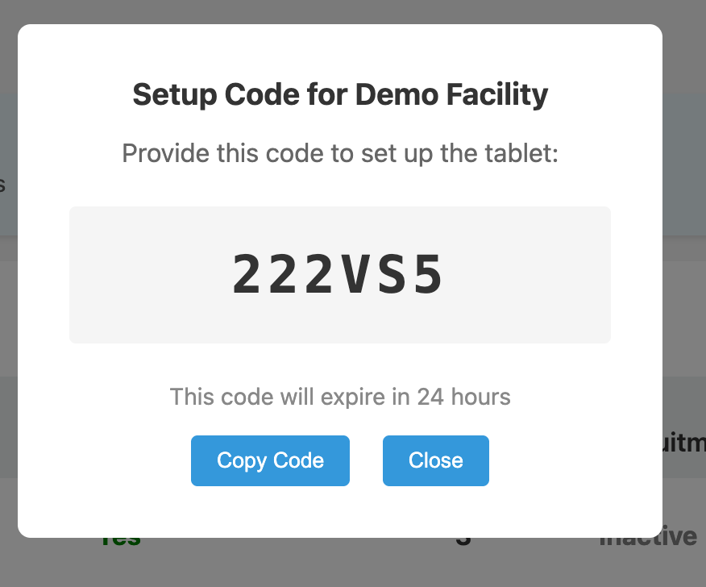
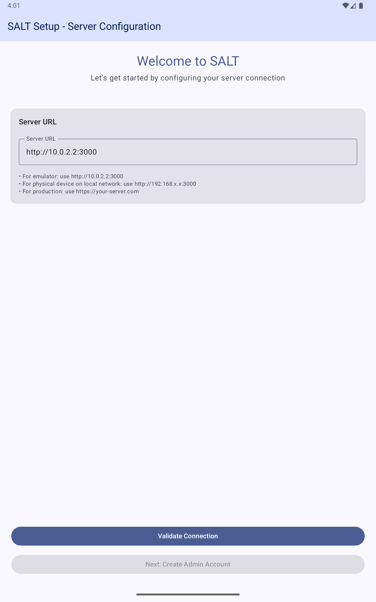
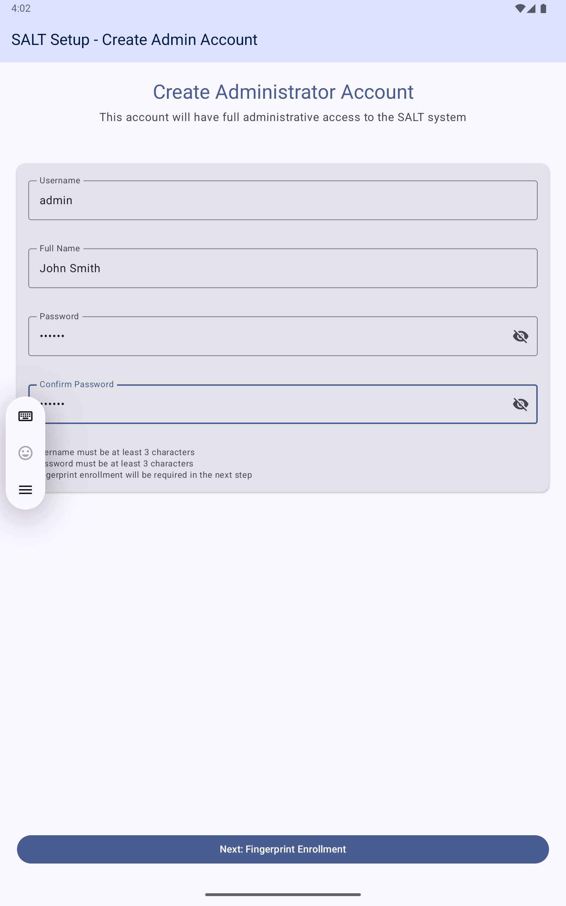
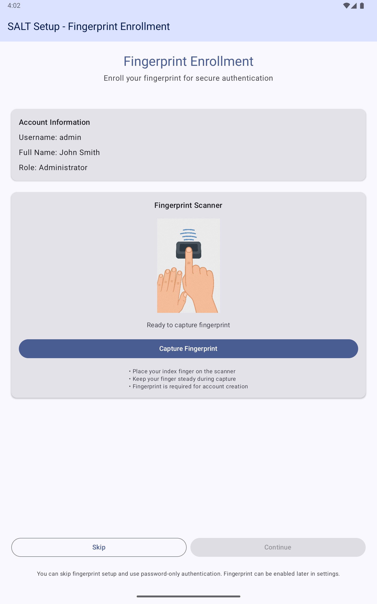

The SALT tablet app runs on Android tablets placed at participating health facilities. This guide covers initial installation and configuration.

## Hardware requirements

- Android 8.0 (Oreo) or later
- 7-inch screen or larger (10-inch recommended for comfortable use during interviews)
- USB OTG (On-The-Go) support, required for the fingerprint scanner
- SecuGen HU20-A fingerprint scanner (optional, falls back to software duplicate checking if not connected)

## Step 1: Install the app from /tablet

From the tablet's browser, navigate to `https://your-server/tablet` and follow the on-screen instructions. This page is public, no login or credentials are required to access it.

Enable installation from unknown sources in **Android Settings → Security → Install unknown apps** when prompted.

## Step 2: Get a setup code

Before setting up the tablet, generate a setup code for the facility on the management server:

1. Log in to the management server
2. Go to **Facilities**
3. Click **Setup Code** next to the facility this tablet will be assigned to
4. Note the 6-character code; it expires in 24 hours.

## Step 3: Configure the server connection

Open the SALT app. The first screen asks for the server URL:

Enter your server URL:
- For production: `https://your-domain.example.org`
- For a local network: `http://192.168.x.x:3000`
- For a development emulator: `http://10.0.2.2:3000`

Tap **Validate Connection**. When the connection succeeds, tap **Next: Create Admin Account**.

The setup code prompt appears, enter the 6-character code from the management server.

## Step 4: Create the tablet administrator account

Fill in:
- **Username**: at least 3 characters
- **Full Name**: the administrator's name
- **Password**: at least 3 characters
- **Confirm Password**

Tap **Next: Fingerprint Enrollment**.

## Step 5: Fingerprint enrollment (optional)

Connect the SecuGen HU20-A scanner via USB OTG before this step. Place your index finger on the scanner and tap **Capture Fingerprint**. The scanner captures multiple samples to create a template.

If you do not have a scanner, tap **Skip** to use password-only authentication. Fingerprint authentication can be enabled later from the admin dashboard.

## Step 6: Verify setup

After setup, the tablet downloads the active survey and facility configuration from the server. The app is ready when the login screen appears.

Log in with the administrator credentials you just created. You should see the **Administrator Dashboard** with options for Manage Users, Server Settings, Survey Status, Language Settings, Coupon Logging, and Developer Settings.

## Connecting the fingerprint scanner

The SecuGen HU20-A connects via USB OTG:

1. Connect the scanner to the tablet using a USB OTG adapter
2. When prompted by Android, grant USB permission to the SALT app
3. Check **Scanner Status** in the admin dashboard; it should show the scanner as connected.

If the scanner is not detected, see [Troubleshooting](/reference/troubleshooting/).

## Next steps

- [Add staff users](/tablet/admin-guide/): create SURVEY_STAFF accounts so staff can conduct interviews
- [Conducting a survey](/tablet/staff-survey/): the staff interview workflow
