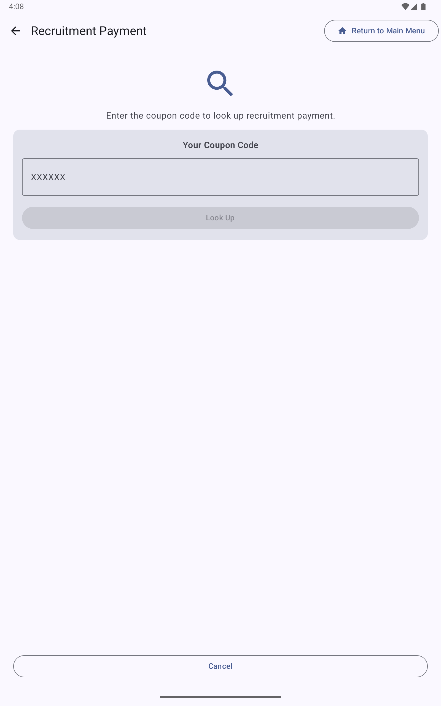

SALT tracks the recruitment chain: each enrolled participant receives coupons to give to members of their network, and the recruiter is paid a small incentive when a person they recruited comes in and completes an interview.

## Recruitment payment workflow

From the **Survey Staff Area**, tap **Recruitment Payment**:

**Step 1, Enter the coupon code**: The participant who wishes to claim their recruitment payment enters (or dictates) the coupon code they distributed to someone who subsequently enrolled. Tap **Look Up**.

**Step 2, Verify**: The app looks up the coupon and displays:
- Whether the coupon was used
- The date the recruited participant completed their interview
- The payment amount due (configured per facility)

**Step 3, Pay**: If everything is correct, process the payment and record it in the app. The payment record is uploaded to the server with the next sync.

## Payment types

Facilities can be configured for different payment types (Cash, voucher, etc.) and different currency/amounts. Payment amounts are set per facility in the management server, see [Facilities](/management/facilities/).

Two separate payment amounts can be configured:

| Payment | Description |
|---------|-------------|
| **Participation Payment** | Paid to every participant who completes an interview |
| **Recruitment Payment** | Paid to a participant when someone they recruited completes an interview |

## Payment audit

If **Require phone for payment audit** is enabled in the survey general settings, the app prompts staff to record a phone number for payment verification. This creates an auditable record linking payments to verifiable contact information.

## Coupon lifecycle

1. Participant enrolls and is issued coupons (number configured per facility, typically 3)
2. Participant distributes coupons to members of their social network
3. Recipients bring their coupon when they come in for an interview
4. The coupon is validated at the start of the interview workflow
5. After the recruited participant's interview is complete, the recruiter may claim their recruitment payment

## Coupon validity

Coupons are valid within the **Recruitment Window** configured for the facility (see [Facilities](/management/facilities/)). Coupons presented outside this window are rejected. The default window is 0–730 days from issue.

## Viewing coupon history

Administrators can view the coupon log from the tablet admin dashboard. On the management server, coupon chain data is included in the **RDS format** export and in the `coupon_` prefixed columns of all exports.
