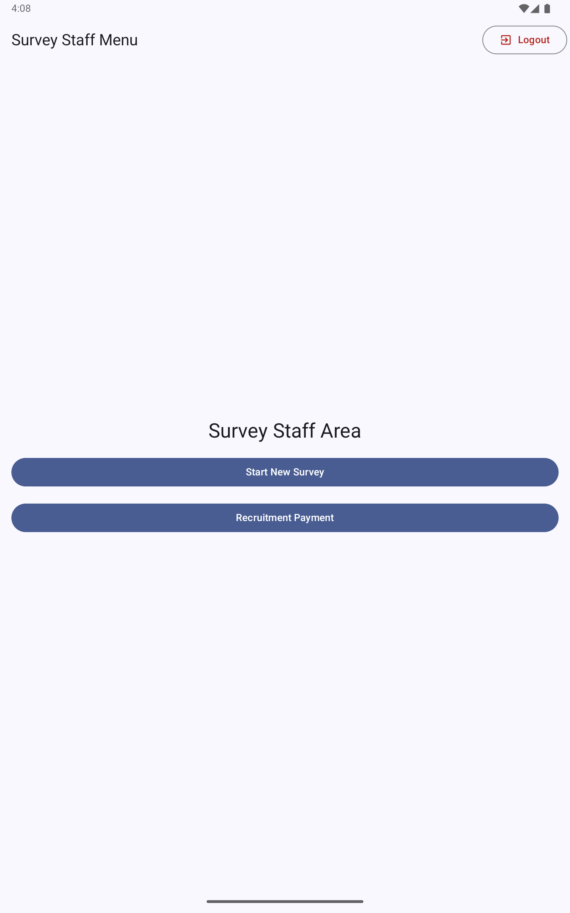

This guide describes the complete flow that a survey staff member follows when interviewing a participant.

## Prerequisites

- The tablet is set up and connected to the server (or has a cached survey from a previous sync)
- A SURVEY_STAFF user account exists on the tablet
- The active survey has been downloaded to the tablet

## Starting an interview

Log in to the tablet with your SURVEY_STAFF credentials. The **Survey Staff Area** screen appears:

Tap **Start New Survey** to begin a new participant interview.

## Coupon verification

The app asks for the participant's coupon code. This is the unique code printed on the coupon they received from a previously enrolled participant.

If the facility is configured to **Allow without coupons**, you may proceed without a coupon code for seed participants or walk-ins.

The app checks:
- Whether the coupon code is valid and belongs to this facility
- Whether the coupon has already been used
- Whether the coupon is within the recruitment window configured for this facility

## Fingerprint screening

If fingerprint screening is enabled in the survey configuration and a SecuGen HU20-A scanner is connected, the app scans the participant's fingerprint and compares it against previously enrolled participants.

If a match is found within the re-enrollment period, the app warns staff that this participant appears to have been enrolled recently. Staff can override with administrator fingerprint approval or password confirmation.

## Eligibility section

The staff member reads the eligibility questions to the participant (if **Staff conducts eligibility screening** is enabled) or the participant answers them on the tablet directly.

After all eligibility questions are answered, the app evaluates the Eligibility Script. If the participant is ineligible, the ineligibility message is displayed (with audio if configured) and the interview ends.

## Main interview (ACASI)

Eligible participants proceed to the self-interview. The participant answers questions on the tablet at their own pace:

- Each question is displayed with its text and, if configured, audio plays automatically
- For multiple choice questions, the participant taps their answer
- For numeric questions, the participant enters a number
- For multi-select questions, the participant taps all applicable answers
- A **Replay** button replays the audio for the current question
- Questions hidden by skip logic do not appear

Staff are not present during the ACASI section to protect participant privacy.

## Rapid tests

After the main interview (if enabled in the survey configuration), the app prompts staff to collect rapid test samples and enter the results. For each configured rapid test, the staff member records the result.

## Completion and payment

At the end of the interview:

1. The app displays a summary screen
2. The staff member approves the participation payment
3. The participant receives their coupons for distributing to their network
4. The completed interview is saved to the tablet's encrypted local database

## Upload

Completed surveys are uploaded to the management server automatically when the tablet has an internet connection. The upload happens in the background — staff do not need to manually trigger it.

To check upload status, an administrator can view **Survey Status** in the admin dashboard:

## Offline operation

The SALT tablet app is designed for offline use. If the tablet has no internet connection:

- Previously downloaded surveys remain available and fully functional
- Completed interviews are stored locally (encrypted)
- Uploads queue automatically and send when connectivity is restored

The tablet does not need to be online to conduct interviews.
